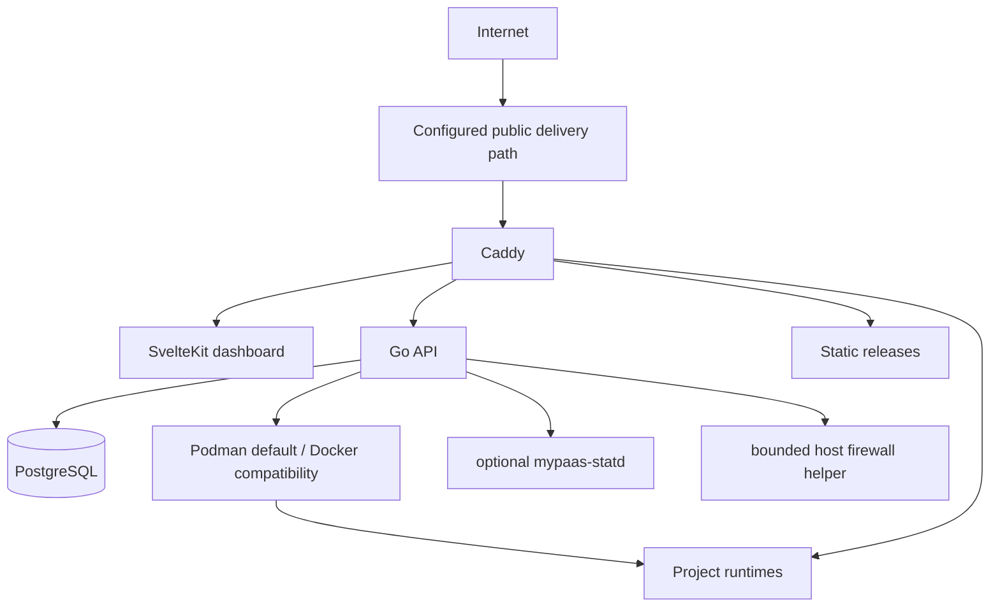

# MyPaaS

MyPaaS is a self-hosted **single-host PaaS** for deploying and operating applications on a Linux server you control.

**Status:** Beta

It is built for an owner developer or a small trusted team. MyPaaS manages deployment, routing, lifecycle, persistence, and common operations without pretending one server has unlimited capacity or multi-tenant isolation.

## Current capabilities

- deploy Git repositories with **Dockerfile**, **Docker Compose**, or **static output**;
- choose repositories available to the connected GitHub account directly from the New Project form, including private repositories;
- deploy OCI images with anonymous pulls or one bounded installation-level credential for a configured registry;
- inspect repositories and support base-directory / monorepo deployments;
- manage encrypted environment variables, editable per-source resource defaults with fixed safety floors, deployment history, logs, metrics, restart, redeploy, and rollback;
- monitor the host-wide Docker-compatible container inventory, including MyPaaS control-plane and application containers, with search, filters, pagination, and live runtime metrics;
- inspect MyPaaS runtime port allocations and manage a narrow set of MyPaaS-owned UFW allow rules from the owner UI;
- provide an owner-only short-lived host shell for trusted VM operators;
- route applications through Caddy with derived project hostnames;
- provide bounded additional HTTP routes for Compose applications that expose more than one HTTP surface;
- provide project-scoped persistent storage and safe owned-resource cleanup;
- provide optional shared PostgreSQL provisioning and DB Studio Lite for PostgreSQL, MySQL, and MariaDB;
- provide backups, restore/migration tooling, image/cache retention, audit logs, CLI, REST API, webhooks, and an optional local MCP bridge;
- use rootful Podman by default on fresh supported hosts, with Docker Engine as a compatibility mode.

Static projects are served directly by Caddy. Container-backed projects run through the configured Docker-compatible engine contract.

## GitHub repository access

The New Project form can list repositories available to the connected GitHub account. Selecting a repository fills its clone URL and default branch; the URL can still be entered manually.

Private GitHub repositories use the OAuth access token saved for the signed-in administrator. MyPaaS encrypts that token in the control-plane database and uses it only for repository listing, inspection, deployment, Compose route validation, and rollback. The token is not passed to project workloads or written to Git command arguments or logs.

## Deployment modes

| Source | Mode | Notes |
| --- | --- | --- |
| Git repository | Dockerfile | Build and run a single managed application runtime |
| Git repository | Docker Compose | Multi-service deployment with one primary public route and optional bounded additional HTTP routes |
| Git repository | Static | Build/publish static files and serve them directly with Caddy |
| OCI registry | Image | Anonymous pull or one configured authenticated registry |

Dockerfile and Compose are the explicit escape hatches for applications with custom deployment requirements. MyPaaS intentionally does not maintain a separate one-click application template catalog.

## Container monitoring

The Containers page lists every container visible through the configured Docker-compatible host runtime, including MyPaaS system/control-plane containers, application containers, sidecars, and stopped containers. Running containers include CPU and memory samples. Search, state/runtime filters, ten-row pagination, and safe removal of non-running containers keep larger hosts usable without adding a second observability stack.

Running containers remain lifecycle-managed through their project. The host-wide view only permits removal after the runtime confirms that a container is stopped.

## Port management

The Ports page distinguishes two things:

- **project bindings** — the runtime ports allocated by MyPaaS, normally bound locally and exposed to HTTP clients through Caddy;
- **managed firewall rules** — explicit UFW allow rules created by MyPaaS on the host.

The firewall control is intentionally narrow:

- owner-only;
- MyPaaS never enables or disables UFW;
- SSH `22/tcp` and Caddy `80/tcp` / `443/tcp` are protected;
- only rules tagged `mypaas-managed` are removable from the UI;
- arbitrary firewall commands and arbitrary rule editing are not exposed.

## Host shell

The Shell page is available only to whitelisted owners. It opens a short-lived shell on the MyPaaS host for trusted operators; it is not public SSH, TCP forwarding, or a project workload terminal. Session input is not written to audit logs, while session start and stop actions are auditable.

## Compose additional HTTP routes

Compose projects may declare up to four additional HTTP routes when an application has multiple HTTP surfaces.

The contract is intentionally narrow:

- Compose only;
- HTTP(S) through Caddy only;
- derived hostname `<project>-<route>.<public-domain>`;
- target must be an existing Compose service and a TCP port declared by `ports` or `expose`;
- no extra host-port publication for the secondary route;
- no arbitrary custom hostname;
- route contract is immutable after first deployment.

See [`docs/adr/ADR-023-compose-additional-http-routes.md`](docs/adr/ADR-023-compose-additional-http-routes.md).

## Operating boundary

MyPaaS currently assumes:

- one Linux host;
- an owner or small trusted team;
- no Kubernetes or multi-node scheduler;
- no control-plane high availability;
- no hostile multi-tenant isolation guarantee;
- no automatic horizontal application scaling;
- no registry proxy, mirror, or pull-through cache;
- no universal application-capacity guarantee.

Application capacity is workload-specific. A static site, Go API, SSR application, database-heavy service, and memory-intensive build can have very different resource requirements on the same host. Project count, concurrent users, RPS, and a particular VM size are therefore **not fixed product capabilities claimed by MyPaaS**.

On a single-host installation, builds, the MyPaaS control plane, databases, and running applications share host resources. Operators remain responsible for sizing the host for their workloads.

## Verification

Repository CI covers source-level behavior such as backend tests, race detection, frontend checks/build, deployment-script syntax, production Compose rendering, and the Docker-compatible Podman contract. Real deployment and host-operation behavior is qualified directly on a VM when a feature requires it.

See [`docs/engineering/beta-readiness-gates.md`](docs/engineering/beta-readiness-gates.md).

## Architecture



## Documentation

- [`PRODUCT.md`](PRODUCT.md) — current product scope and non-goals
- [`ROADMAP.md`](ROADMAP.md) — current product direction
- [`docs/README.md`](docs/README.md) — documentation index and source-of-truth rules
- [`docs/ARCHITECTURE.md`](docs/ARCHITECTURE.md) — canonical architecture
- [`docs/SECURITY_BOUNDARIES.md`](docs/SECURITY_BOUNDARIES.md) — trust and isolation boundaries
- [`docs/STATD.md`](docs/STATD.md) — optional native telemetry integration

## Development

```bash
make dev
make test
make build
```

See [`CONTRIBUTING.md`](CONTRIBUTING.md) and [`AGENTS.md`](AGENTS.md) for repository conventions.

## License

See [`LICENSE`](LICENSE).
