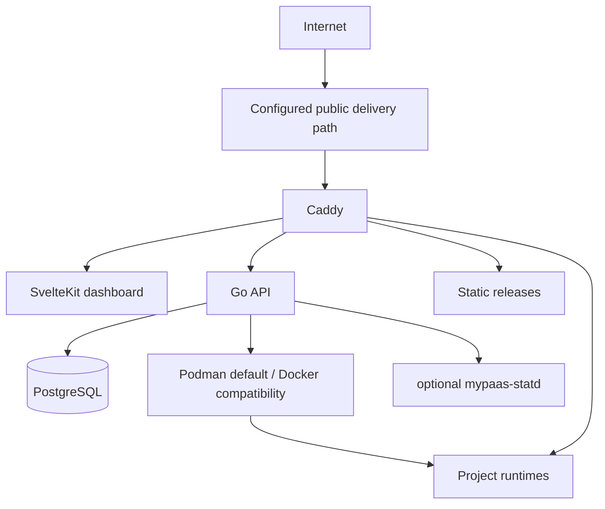

# MyPaaS

MyPaaS is a self-hosted **single-host PaaS** for deploying and operating applications on a Linux server you control.

**Status:** Beta

It is built for an owner developer or a small trusted team. MyPaaS manages deployment, routing, lifecycle, persistence, and common operations without pretending one server has unlimited capacity or multi-tenant isolation.

## Current capabilities

- deploy Git repositories with **Dockerfile**, **Docker Compose**, or **static output**;
- deploy OCI images with anonymous pulls from public registries or one bounded installation-level credential for a configured private registry;
- inspect repositories and support base-directory / monorepo deployments;
- manage encrypted environment variables, resource settings, deployment history, logs, metrics, restart, redeploy, and rollback;
- route applications through Caddy with derived project hostnames;
- provide bounded additional HTTP routes for Compose applications that expose more than one HTTP surface;
- provide project-scoped persistent storage and safe owned-resource cleanup;
- provide optional shared PostgreSQL provisioning and DB Studio Lite for PostgreSQL, MySQL, and MariaDB;
- provide backups, restore/migration tooling, image/cache retention, audit logs, CLI, REST API, webhooks, and an optional local MCP bridge;
- expose qualified OSS application templates and a real-world compatibility catalog;
- use rootful Podman by default on fresh supported hosts, with Docker Engine as a compatibility mode.

Static projects are served directly by Caddy. Container-backed projects run through the configured Docker-compatible engine contract.

## Deployment modes

| Source | Mode | Notes |
| --- | --- | --- |
| Git repository | Dockerfile | Build and run a single managed application runtime |
| Git repository | Docker Compose | Multi-service deployment with one primary public route and optional bounded additional HTTP routes |
| Git repository | Static | Build/publish static files and serve them directly with Caddy |
| OCI registry | Image | Anonymous pull or one configured authenticated registry for image-mode deployments |

Dockerfile and Compose remain the explicit escape hatches for applications that do not fit repository inspection.

## Compose additional HTTP routes

Compose projects may declare up to four additional HTTP routes when an application has multiple HTTP surfaces, for example MinIO's S3 API and web Console.

The contract is intentionally narrow:

- Compose only;
- HTTP(S) through Caddy only;
- derived hostname `<project>-<route>.<public-domain>`;
- target must be an existing Compose service and a TCP port declared by `ports` or `expose`;
- no extra host-port publication for the secondary route;
- no arbitrary custom hostname;
- no raw TCP, SSH, or UDP forwarding;
- route contract is immutable after first deployment.

MinIO is the first real-VM-qualified application using this primitive. See [`docs/adr/ADR-023-compose-additional-http-routes.md`](docs/adr/ADR-023-compose-additional-http-routes.md) and [`compatibility/CATALOG.md`](compatibility/CATALOG.md).

## Operating boundary

MyPaaS currently assumes:

- one Linux host;
- an owner or small trusted team;
- no Kubernetes or multi-node scheduler;
- no control-plane high availability;
- no hostile multi-tenant isolation guarantee;
- no automatic horizontal application scaling;
- no registry proxy, mirror, or pull-through cache;
- no universal application-capacity guarantee.

Application capacity is workload-specific. A static site, Go API, SSR application, database-heavy service, and memory-intensive build can have very different resource requirements on the same host. Project count, concurrent users, RPS, and a particular VM size are therefore **not fixed product capabilities claimed by MyPaaS**.

On a single-host installation, builds, the MyPaaS control plane, databases, and running applications share host resources. Operators remain responsible for sizing the host for their workloads.

## Verification and compatibility

Repository CI and controlled runtime checks cover platform behavior such as deployment safety, rollback, backup/restore, cleanup, routing reconciliation, Create Project behavior, DB Studio, and Docker/Podman compatibility.

The compatibility suite separately asks whether MyPaaS can correctly host representative real-world OSS application patterns. A compatibility `PASS` means the declared deployment and smoke/lifecycle checks succeeded on the tested host. It is **not** a throughput, concurrency, or hardware-capacity certification.

See [`docs/engineering/beta-readiness-gates.md`](docs/engineering/beta-readiness-gates.md) and [`compatibility/CATALOG.md`](compatibility/CATALOG.md).

## Architecture



## Documentation

- [`PRODUCT.md`](PRODUCT.md) — current product scope and non-goals
- [`ROADMAP.md`](ROADMAP.md) — current product direction
- [`docs/README.md`](docs/README.md) — documentation index and source-of-truth rules
- [`docs/ARCHITECTURE.md`](docs/ARCHITECTURE.md) — canonical architecture
- [`docs/SECURITY_BOUNDARIES.md`](docs/SECURITY_BOUNDARIES.md) — trust and isolation boundaries
- [`compatibility/CATALOG.md`](compatibility/CATALOG.md) — real-world application compatibility
- [`docs/STATD.md`](docs/STATD.md) — optional native telemetry integration

## Development

```bash
make dev
make test
make build
```

See [`CONTRIBUTING.md`](CONTRIBUTING.md) and [`AGENTS.md`](AGENTS.md) for repository conventions.

## License

See [`LICENSE`](LICENSE).
