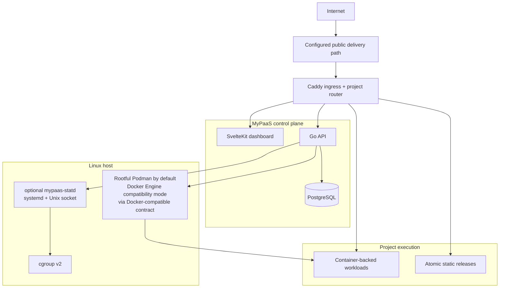
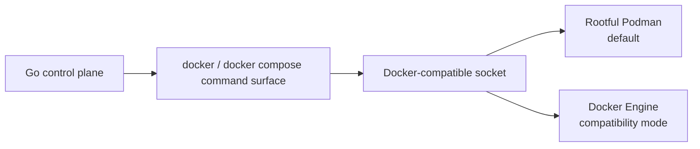

# Architecture — MyPaaS

> Canonical architecture entry point for the current single-host implementation.

**Status:** Current  
**Applies to:** `main`  
**Last verified:** 2026-08-28  
**Verified against commit:** `e12f47dd3249e2fdd69df352852ff3c9c3489245`

---

## System at a glance



MyPaaS targets one Linux host. It is a self-hosted deployment control plane, not a Kubernetes scheduler, multi-node orchestrator, HA control plane, or mutually hostile multi-tenant sandbox.

Fresh supported Ubuntu/Debian installations are Podman-first. Docker Engine remains an explicit compatibility mode.

## Production components

`docker-compose.prod.yml` runs five control-plane containers:

| Component | Responsibility | Important boundary |
| --- | --- | --- |
| `api` | Auth, project state, deployments, lifecycle, routing, backups, migration, DB Studio, CLI/MCP APIs | Holds Docker-compatible engine authority |
| `dashboard` | SvelteKit operator UI | Control network only |
| `postgres` | MyPaaS state and optional shared project PostgreSQL | Intentionally dual-homed on control + project networks |
| `caddy` | Dashboard/API ingress, static serving, primary and additional project HTTP routing | Admin API is Unix-socket only in production |
| `cloudflared` | Outbound Cloudflare Tunnel client | Control network only |

`mypaas-statd` is host-native and is not a sixth Compose service. It runs under systemd and communicates with the API through `/run/mypaas/statd.sock`.

## Runtime abstraction

MyPaaS keeps one orchestration contract while preferring Podman for fresh Linux hosts:



Production normalizes the host runtime socket into the stable in-container path `/var/run/docker.sock` for the API. The deploy helper accepts a configured live socket and can resolve rootful Podman (`/run/podman/podman.sock`) or Docker (`/var/run/docker.sock`) before starting the stack.

Podman is therefore not a second orchestration backend; it supplies the Docker-compatible command/socket contract expected by the control plane.

## Network model

Production uses three distinct external networks:

| Network | Members | Purpose |
| --- | --- | --- |
| `CONTROL_NETWORK` | API, dashboard, cloudflared, PostgreSQL, Caddy | Control-plane communication |
| `PROJECT_NETWORK` | Project workloads, PostgreSQL | Workload communication and optional shared PostgreSQL |
| `ROUTING_NETWORK` | Caddy + explicitly routed runtimes | Public HTTP application data plane |

The API is not attached to the project or routing networks. Caddy is not attached to the general project network. A workload receives routing-network membership only as required for an explicit public route.

See [Networking and trust boundaries](architecture/networking.md).

## Deployment model

Supported source/deployment modes are:

| Source | Mode | Runtime model |
| --- | --- | --- |
| Git | Dockerfile | Build image, start replacement container, activate route |
| Git | Compose | Render + validate Compose, apply managed override, start services, activate primary and declared additional HTTP routes |
| Git | Static | Build when needed, publish atomic release, serve files directly from Caddy |
| Registry | Image | Pull OCI image, start replacement container, activate route |

Image-mode registry pulls are anonymous by default and may use one bounded installation-level credential when the requested image host matches the configured registry. That credential is not inherited by project Compose environments.

Allocated host ports remain runtime identity keys for normal container-backed primary routes. Production Caddy traffic uses managed routing-network aliases and internal container ports rather than hairpinning through the host port.

### Compose additional HTTP routes

Compose projects may declare up to four additional HTTP routes.

Each route:

- uses a platform-derived hostname `<project>-<route>.<PUBLIC_DOMAIN>`;
- targets an existing Compose service and a TCP port declared by `ports` or `expose`;
- is routed through Caddy over `ROUTING_NETWORK`;
- does not allocate or publish another host port;
- is reconciled during initial deployment, lifecycle actions, periodic recovery, and deletion;
- is immutable after first deployment in the current version.

This capability is intentionally HTTP-only. It does not expose raw TCP, SSH, UDP, arbitrary public host ports, or custom per-route domains.

MinIO is the first real-VM-qualified application using this primitive: S3 API on the primary route and the Console on a derived secondary route.

See [Deployment architecture](architecture/deployment.md) and [ADR-023](adr/ADR-023-compose-additional-http-routes.md).

## Security posture

The container-engine socket is host-level authority. Dropping capabilities and enabling `no-new-privileges` reduces ambient Linux privilege but does not make engine access low privilege.

Repository Compose files are untrusted input. MyPaaS renders and validates the configuration before execution and rejects host-escape features including privileged mode, host/container namespace sharing, engine socket mounts, host bind mounts, devices, added capabilities, GPUs, custom runtimes, external networks/volumes, unsafe build entitlements, build SSH/secrets, and privileged lifecycle hooks.

Safe engine-managed named volumes are allowed by Compose sanitization; migration has a separate portability preflight for engine-managed volume state.

This is a bounded single-host policy boundary, not VM/microVM isolation for arbitrary hostile tenants.

See [Security boundaries](SECURITY_BOUNDARIES.md).

## Observability model

Runtime metrics can use optional `mypaas-statd` over its local Unix socket. If statd is disabled or unavailable, runtime metrics fall back to the Docker-compatible engine path.

Host telemetry is optional. Project logs remain on the Docker-compatible CLI path.

See [Observability architecture](architecture/observability.md) and [mypaas-statd integration](STATD.md).

## Persistence and recovery

Host-managed application state includes:

```text
/var/lib/mypaas/volumes
/var/lib/mypaas/compose
/var/lib/mypaas/static
/var/lib/mypaas/backups
```

Control-plane PostgreSQL data uses the production Compose `postgres_data` named volume.

VM export performs storage preflight before downtime. Engine-managed Compose named/external volume state can be rejected by migration preflight when portability cannot be guaranteed.

## Verification boundary

Repository CI verifies code, race safety, frontend checks/build, script regressions, production Compose rendering, and Docker/Podman command-contract behavior.

Controlled runtime qualification verifies behavior such as deployment/recovery safety, routing reconciliation, backup/restore, cleanup, Create Project behavior, DB Studio, and compatibility paths that changed materially.

PR #157's bounded Compose HTTP-route primitive was qualified on VM `172.104.61.180` at exact head `b35176fd0156c8128e988a2ce3a46693a150c61d` before merge. The qualification proved primary and Console routing, no extra `9001` host publication, restart/redeploy persistence, reconciliation after deliberate route removal, and stop/delete cleanup.

These checks establish correctness for the tested scenario. They do not establish universal throughput, concurrent-user capacity, project count, or hardware requirements.

## Detailed architecture

- [Overview](architecture/overview.md)
- [Networking and trust boundaries](architecture/networking.md)
- [Deployment architecture](architecture/deployment.md)
- [Observability architecture](architecture/observability.md)
- [Security boundaries](SECURITY_BOUNDARIES.md)
- [mypaas-statd integration](STATD.md)
- [Architecture decisions](adr/)
- [Documentation index](README.md)
