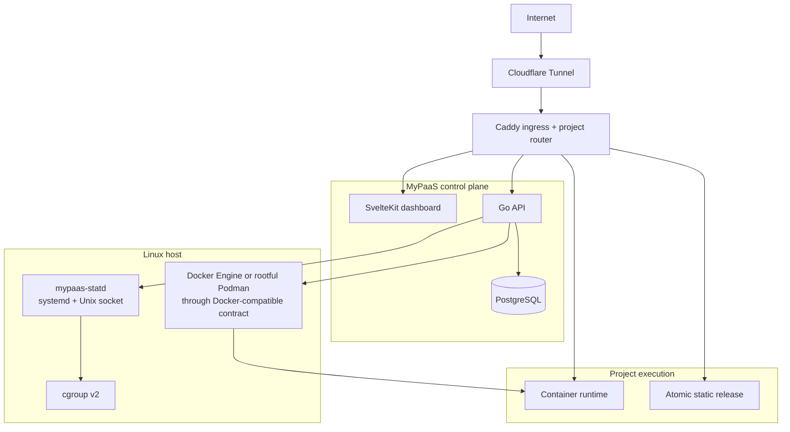
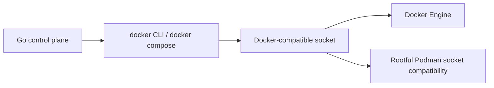

# Architecture — MyPaaS

> Canonical architecture entry point for the current single-host implementation.

**Status:** Current  
**Applies to:** `main`  
**Last verified:** 2026-08-13  
**Verified against commit:** `8769f0bb5373e8ec8ca584d6e2cbbf6fb5820cbf`

---

## System at a glance



MyPaaS targets one Linux VM. It is a self-hosted deployment control plane, not a Kubernetes scheduler, multi-node orchestrator, or mutually hostile multi-tenant sandbox.

## Production components

`docker-compose.prod.yml` runs five control-plane containers:

| Component | Responsibility | Important boundary |
| --- | --- | --- |
| `api` | Auth, project state, deployments, lifecycle, routing, backups, migration, DB Studio, CLI/MCP APIs | Holds Docker-compatible engine authority |
| `dashboard` | SvelteKit operator UI | Control network only |
| `postgres` | MyPaaS state and optional shared project PostgreSQL | Intentionally dual-homed on control + project networks |
| `caddy` | Dashboard/API ingress, static serving, dynamic project routing | Admin API is Unix-socket only in production |
| `cloudflared` | Outbound Cloudflare Tunnel client | Control network only |

`mypaas-statd` is host-native and is **not** a sixth Compose service. It runs under systemd and communicates with the API through `/run/mypaas/statd.sock`.

## Runtime abstraction

MyPaaS deliberately keeps one engine contract:



Podman support does not introduce a separate orchestration backend. Production Podman hosts expose the Docker-compatible command/socket surface expected by the control plane.

## Network model

Production uses three distinct external networks:

| Network | Members | Purpose |
| --- | --- | --- |
| `CONTROL_NETWORK` | API, dashboard, cloudflared, PostgreSQL, Caddy | Control-plane communication |
| `PROJECT_NETWORK` | Project workloads, PostgreSQL | Workload communication and optional shared PostgreSQL |
| `ROUTING_NETWORK` | Caddy + explicitly routed runtimes | Public application data plane |

The API is not attached to the project or routing networks. Caddy is not attached to the general project network. A container runtime receives routing-network membership only while MyPaaS activates its public route.

See [Networking and trust boundaries](architecture/networking.md) for the detailed topology and route-activation sequence.

## Deployment model

Supported source/deployment modes are:

| Source | Mode | Runtime model |
| --- | --- | --- |
| Git | Dockerfile | Build image, start replacement container, activate route |
| Git | Compose | Render + validate Compose, apply managed override, start services, route public service |
| Git | Static | Build when needed, publish atomic release, serve files directly from Caddy |
| Registry | Image | Pull public OCI image, start replacement container, activate route |

Allocated host ports remain runtime identity keys for container-backed projects. In production they are **not** the Caddy traffic path. Route activation resolves the matching runtime, verifies project-network membership, attaches it to `ROUTING_NETWORK` with `mypaas-port-<allocated-port>`, and configures Caddy to dial that alias on the internal container port.

See [Deployment architecture](architecture/deployment.md).

## Security posture

The control plane intentionally treats the container-engine socket as host-level authority. Dropping capabilities and enabling `no-new-privileges` reduces the API container's ambient Linux privilege, but it does not make the engine socket a low-privilege interface.

Repository Compose files are untrusted input. MyPaaS renders and validates the configuration before execution and rejects host-escape features including privileged mode, host/container namespace sharing, engine socket mounts, host bind mounts, devices, added capabilities, GPUs, custom runtimes, external networks, external volumes, unsafe build entitlements, build SSH/secrets, and privileged lifecycle hooks.

Safe engine-managed named volumes are allowed by Compose sanitization; migration has a separate portability preflight for engine-managed volume state.

This is a strong single-host policy boundary. It is not equivalent to VM or microVM isolation for arbitrary hostile tenants.

See [Security boundaries](SECURITY_BOUNDARIES.md).

## Observability model

Runtime metrics prefer `mypaas-statd` over its local Unix socket. The daemon reads cgroup v2 and avoids repeated Docker/Podman process spawning on the steady-state metrics path. Runtime-statd failure is non-fatal and falls back to the Docker-compatible implementation.

With the current v0.2.0 rollout, host stats can also include optional CPU, memory, storage, and network snapshots from statd. Capacity/allocation values remain available when host telemetry is disabled or unavailable.

Project logs remain on the Docker-compatible CLI path. The repository keeps a benchmark harness for that path so a future native collector is justified by evidence rather than architecture preference.

See [Observability architecture](architecture/observability.md) and [mypaas-statd integration](STATD.md).

## Persistence and recovery

Host-managed application state includes:

```text
/var/lib/mypaas/volumes
/var/lib/mypaas/compose
/var/lib/mypaas/static
/var/lib/mypaas/backups
```

Control-plane PostgreSQL data uses the production Compose `postgres_data` named volume.

VM export performs storage preflight before downtime, quiesces runtime workloads without changing desired database state, packages supported state, restores runtimes, and only then marks the export ready. Engine-managed Compose named/external volumes are rejected by migration preflight because their portability between Docker Engine and Podman cannot be assumed.

## Verification boundary

Repository CI verifies code, race safety, frontend checks/build, script regressions, production Compose rendering, and Docker/Podman command-contract behavior. `scripts/verify-production.sh` validates live production topology including API readiness, network membership, configured statd service/socket, the Caddy Admin Unix socket, and the absence of a published Caddy TCP admin endpoint.

Real-host performance and final production behavior remain staging/benchmark concerns; they are not inferred solely from CI.

## Detailed architecture

- [Overview](architecture/overview.md)
- [Networking and trust boundaries](architecture/networking.md)
- [Deployment architecture](architecture/deployment.md)
- [Observability architecture](architecture/observability.md)
- [Security boundaries](SECURITY_BOUNDARIES.md)
- [mypaas-statd integration](STATD.md)
- [Architecture decisions](adr/)
- [Documentation index](README.md)
