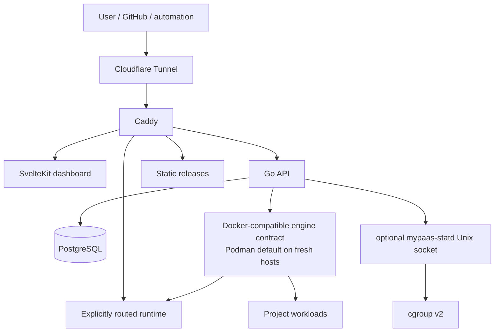

# MyPaaS Documentation

> Technical documentation for the current single-host MyPaaS beta implementation.

**Status:** Current  
**Applies to:** `main` and the `v0.5.0-beta.1` release line  
**Last verified:** 2026-08-16  
**Qualified runtime candidate:** `ddc26c9a0f877fc5dd4133d6559c5f36123d6a31`

The beta qualification identity above is the last runtime-affecting candidate that completed the mandatory release gates. Later documentation-only commits may advance `main` without requiring runtime requalification when their diff contains no runtime, configuration, dependency, migration, or deployment changes.

---

## Start here

| Document | Use it for |
| --- | --- |
| [Repository README](../README.md) | Product entry point, beta scope, install commands, supported deployment modes, and limitations |
| [Beta release notes](releases/v0.5.0-beta.1.md) | What is included in the beta, qualification provenance, upgrade guidance, and known limitations |
| [Beta readiness gates](engineering/beta-readiness-gates.md) | Evidence-backed gate matrix, tested SHAs, carry-forward reasoning, and caveats |
| [Architecture overview](architecture/overview.md) | System context, control-plane components, request paths, and scope |
| [Networking and trust boundaries](architecture/networking.md) | Network membership, isolation intent, Caddy routing boundary, and engine authority |
| [Deployment architecture](architecture/deployment.md) | Dockerfile, Compose, static, registry-image flows, lifecycle states, and route activation |
| [Observability architecture](architecture/observability.md) | Runtime metrics, host telemetry, statd fallback behavior, logs, and operational signals |
| [Institutional readiness runbook](operations/institutional-readiness-runbook.md) | Evidence gates before calling a single-machine installation institution-ready |
| [Security boundaries](SECURITY_BOUNDARIES.md) | Security contract and explicitly trusted/privileged surfaces |
| [mypaas-statd integration](STATD.md) | statd installation, protocol compatibility, runtime flow, host telemetry, and benchmark evidence |
| [Architecture decisions](adr/) | Why important architectural choices were made |
| [Product scope](../PRODUCT.md) | Target users, product boundaries, non-goals, and UX principles |

## Documentation source of truth

MyPaaS documentation is intentionally separated by purpose so current behavior is not mixed with historical requirements or future proposals.

Use this order when sources disagree:

1. current code, schema, tests, installers, and production configuration;
2. evidence-backed release and beta-readiness records;
3. current technical documentation under `docs/`;
4. accepted ADRs for decision rationale;
5. product direction documents;
6. historical requirements and proposed ADRs.

`docs/PRD.md` predates the production-hardening and beta-readiness program. Treat it as a **historical requirements document**, not as an authoritative description of the current runtime.

## Release-claim rules

Public claims should be narrower than the implementation whenever evidence is ambiguous.

- Describe fresh supported Linux installations as **Podman-first**. Rootful Podman is the installer default (`USE_PODMAN=true`); Docker Engine is an explicit supported compatibility mode selected with `USE_PODMAN=false`.
- Keep the implementation detail precise: MyPaaS still uses a Docker-compatible `docker` / `docker compose` command and socket contract even when Podman is the actual engine.
- Do not call Podman optional merely because Docker Engine is also supported. The optional component is `mypaas-statd`, whose metrics path can fall back to the Docker-compatible engine implementation.
- Do not call MyPaaS multi-node, highly available, or multi-tenant: the current architecture is single-host and intended for an owner or small trusted team.
- Do not turn the 50-project qualification result into a universal capacity promise. It is evidence for the tested VM shape and fixture mix.
- Do not claim private-registry authentication. Registry deployment currently targets public OCI images.
- Do not claim Docker-to-Podman in-place migration. Stateful engine changes use the migration/export path to a fresh host.
- Do not describe a roadmap item as implemented merely because it appears in a plan or historical PRD.
- Keep benchmark claims tied to recorded artifacts.
- Keep the runtime-qualified SHA separate from later docs-only release commits.

## Current architecture map



This diagram is intentionally high level. The architecture documents split the system into smaller diagrams so network membership, privileged control paths, deployment state, and telemetry remain readable.

## Document lifecycle

Living technical documents should carry this metadata where practical:

```text
Status: Current | Proposed | Historical | Superseded
Applies to: main / release tag
Last verified: YYYY-MM-DD
Verified against: <sha or release lineage>
```

The goal is not to imply documentation never drifts; it is to make drift visible and reviewable.

## Historical and auxiliary material

The repository also contains audits, UX evidence, engineering experiments, and implementation work notes. They are useful evidence, but they are not automatically part of the current runtime contract.

- `docs/audits/` — implementation and production audit evidence;
- `docs/ux/` — UX contract/audit material;
- `docs/superpowers/` — implementation work notes and plans;
- `docs/PRD.md` — historical product requirements;
- `artifacts/beta-readiness/` — repository-preserved historical qualification artifacts; durable final runtime evidence is indexed by the beta-readiness gate document.

For current behavior, begin with the repository README, beta release notes, beta gate matrix, and architecture/security documentation.
