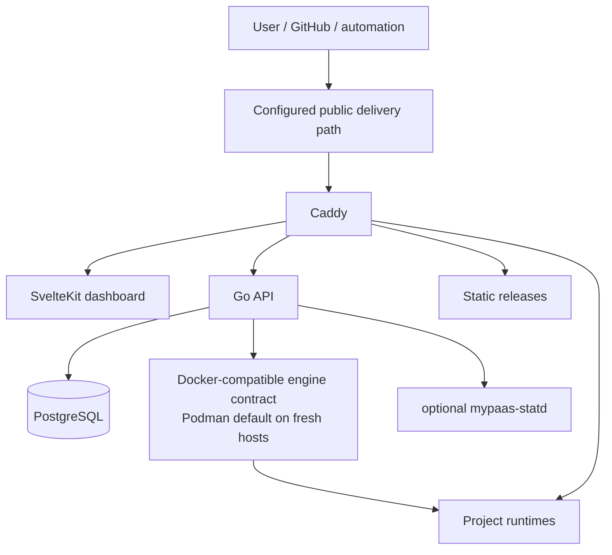

# MyPaaS Documentation

Technical documentation for the current single-host MyPaaS beta.

## Start here

| Document | Purpose |
| --- | --- |
| [Repository README](../README.md) | Product scope and current capabilities |
| [Product scope](../PRODUCT.md) | Target users, boundaries, and non-goals |
| [Product roadmap](../ROADMAP.md) | Current feature priorities, deferrals, and explicit non-targets |
| [Architecture](ARCHITECTURE.md) | System architecture |
| [Architecture overview](architecture/overview.md) | Control-plane components and request paths |
| [Deployment architecture](architecture/deployment.md) | Dockerfile, Compose, static, and OCI image deployment |
| [Real-world compatibility](../compatibility/CATALOG.md) | OSS workload classes, manifests, and compatibility result rules |
| [Networking](architecture/networking.md) | Routing and trust boundaries |
| [Observability](architecture/observability.md) | Logs and metrics |
| [Security boundaries](SECURITY_BOUNDARIES.md) | Security model |
| [Runtime verification](engineering/beta-readiness-gates.md) | Retained reliability regression record |
| [mypaas-statd](STATD.md) | Optional native telemetry integration |
| [Architecture decisions](adr/) | Accepted design decisions |

## Source of truth

When documentation disagrees, use this order:

1. current code, schema, tests, installers, and production configuration;
2. current architecture and security documentation;
3. accepted ADRs;
4. product direction documents;
5. historical requirements.

`PRD.md` is historical and is not authoritative for the current runtime.

## Claim rules

- MyPaaS is a single-host platform for an owner developer or small trusted team.
- Fresh supported hosts are Podman-first; Docker Engine remains an explicit compatibility mode.
- OCI image deployment supports anonymous pulls and one bounded configured private-registry credential; do not claim registry proxy/cache behavior.
- Do not claim multi-node HA, Kubernetes-style scheduling, or hostile multi-tenant isolation.
- Do not turn a test fixture count, VM shape, RPS result, or concurrent-user run into a product-capacity promise.
- Application capacity depends on the application and on available CPU, memory, storage, network, database behavior, and build requirements.
- A compatibility PASS only means the declared deployment and smoke checks succeeded for that application on the tested host.
- Generated test artifacts belong outside the source tree unless a specific review requires them.
- Roadmap and experiment documents are not current product behavior.

## Architecture map

Keep public documentation about current behavior concise. Historical investigations can remain in Git history, issues, or pull requests rather than being promoted as product documentation.
