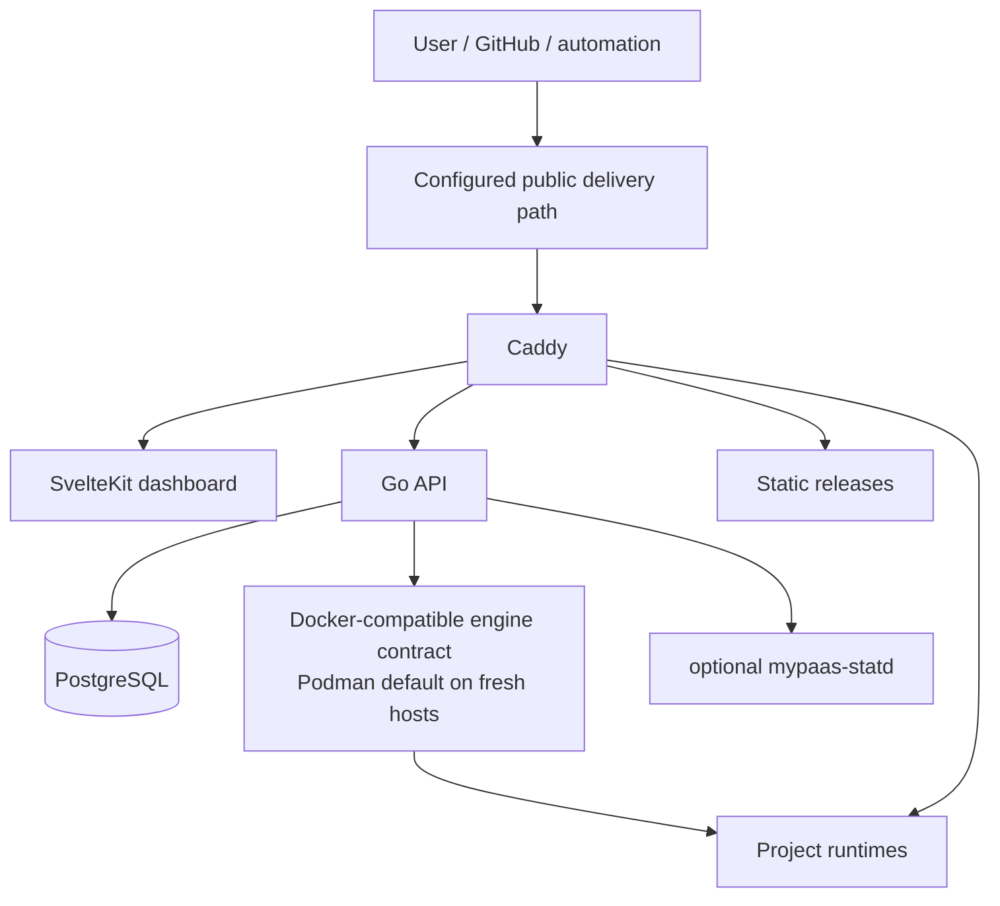

# MyPaaS Documentation

Technical documentation for the current single-host MyPaaS beta.

## Start here

| Document | Purpose |
| --- | --- |
| [Repository README](../README.md) | Current product scope and capabilities |
| [Product scope](../PRODUCT.md) | Target users, delivered boundaries, and non-goals |
| [Product roadmap](../ROADMAP.md) | Current direction, delivered productization, deferrals, and explicit non-targets |
| [Architecture](ARCHITECTURE.md) | Canonical system architecture |
| [Architecture overview](architecture/overview.md) | Control-plane components and request paths |
| [Deployment architecture](architecture/deployment.md) | Dockerfile, Compose, static, and OCI image deployment |
| [Networking](architecture/networking.md) | Routing, runtime aliases, and trust boundaries |
| [Observability](architecture/observability.md) | Logs and metrics |
| [Security boundaries](SECURITY_BOUNDARIES.md) | Security and trust model |
| [Real-world compatibility](../compatibility/CATALOG.md) | OSS workload classes and compatibility-result rules |
| [Runtime verification](engineering/beta-readiness-gates.md) | Retained reliability and qualification record |
| [mypaas-statd](STATD.md) | Optional native telemetry integration |
| [Architecture decisions](adr/) | Accepted design decisions |

## UX planning

- [Control-plane UI reliability and refinement plan](ux/control-plane-ui-refactor-plan.md) — proposed, implementation-grounded work packages for operational state, high-trust actions, telemetry, responsive tables, and theme parity.

## Source of truth

When documentation disagrees, use this order:

1. current code, schema, tests, installers, and production configuration;
2. current architecture and security documentation;
3. accepted ADRs;
4. current product scope and roadmap;
5. historical requirements and release notes.

`PRD.md` is explicitly historical and is not authoritative for the current runtime. Files under `docs/releases/` describe the named historical release and should not be rewritten to pretend they represent current `main`.

## Current product facts that must remain consistent

- MyPaaS is a single-host platform for an owner developer or small trusted team.
- Fresh supported hosts are Podman-first; Docker Engine remains an explicit compatibility mode.
- OCI image-mode deployment supports anonymous pulls and one bounded configured private-registry credential.
- Compose can expose one primary route plus up to four bounded additional HTTP routes using platform-derived hostnames and internal service ports.
- Additional Compose HTTP routes do not imply generic host-port, raw TCP, SSH, UDP, or arbitrary-domain routing support.
- Project-scoped persistence, cleanup, backup/restore, shared PostgreSQL, and DB Studio remain bounded by their documented contracts.
- Compatibility `PASS` means the declared deployment and smoke/lifecycle checks succeeded on the tested host; it is not a capacity certification.

## Claim rules

- Do not claim multi-node HA, Kubernetes-style scheduling, hostile multi-tenant isolation, or automatic horizontal scaling.
- Do not claim generic private-registry management beyond the one configured image-mode credential in ADR-022.
- Do not reinterpret ADR-023 as permission for arbitrary port forwarding or non-HTTP protocol exposure.
- Treat GitHub OAuth repository access as a control-plane credential boundary; do not pass the token to workloads or logs.
- Do not turn a test fixture count, VM shape, RPS result, or concurrent-user run into a product-capacity promise.
- Application capacity depends on the application and on available CPU, memory, storage, network, database behavior, and build requirements.
- Generated test artifacts belong outside the source tree unless a specific review requires them.
- Historical roadmap/experiment/release documents are not current product behavior unless explicitly marked current.

## Architecture map

Keep current public documentation concise and implementation-grounded. Historical investigations belong in Git history, closed issues/PRs, historical release notes, or retained evidence rather than being promoted back into current product scope.
