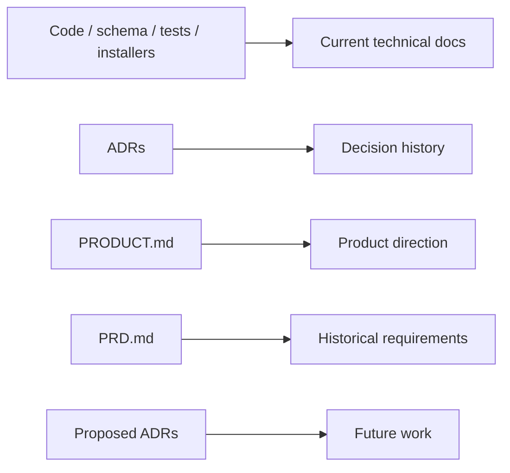
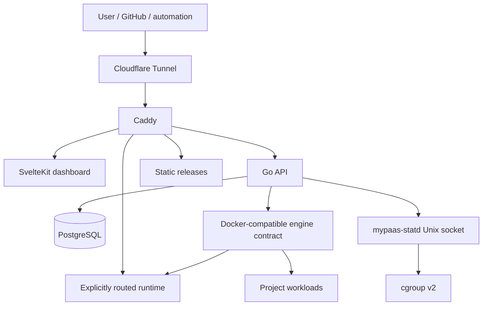

# MyPaaS Documentation

> Technical documentation for the current single-host MyPaaS implementation.

**Status:** Current  
**Applies to:** `main`  
**Last verified:** 2026-08-13  
**Verified against commit:** `f76102997089a3f1a3b5e7d9f4326582ff22e02c`

---

## Start here

| Document | Use it for |
| --- | --- |
| [Architecture overview](architecture/overview.md) | System context, control-plane components, request paths, and scope |
| [Networking and trust boundaries](architecture/networking.md) | Network membership, isolation intent, Caddy routing boundary, and engine authority |
| [Deployment architecture](architecture/deployment.md) | Dockerfile, Compose, static, registry-image flows, lifecycle states, and route activation |
| [Observability architecture](architecture/observability.md) | Runtime metrics, host telemetry, statd fallback behavior, logs, and operational signals |
| [Security boundaries](SECURITY_BOUNDARIES.md) | Security contract and explicitly trusted/privileged surfaces |
| [mypaas-statd integration](STATD.md) | statd installation, protocol compatibility, runtime flow, host telemetry, and benchmark evidence |
| [Architecture decisions](adr/) | Why important architectural choices were made |
| [Product direction](../PRODUCT.md) | Product audience, design principles, and UX constraints |
| [Repository README](../README.md) | Product entry point, quick start, capabilities, and operational commands |

## Documentation model

MyPaaS documentation is intentionally separated by purpose so that current behavior is not mixed with historical requirements or future proposals.



### Source-of-truth order

When two sources disagree, use this order:

1. current code, schema, tests, installers, and production configuration;
2. current technical documentation under `docs/`;
3. accepted ADRs for decision rationale;
4. product direction documents;
5. historical requirements and proposed ADRs.

The current `docs/PRD.md` predates the production-hardening work and should be read as a **historical requirements document**, not as an authoritative description of current runtime behavior.

## Document lifecycle

Living technical documents should carry this header near the top:

```text
Status: Current | Proposed | Historical | Superseded
Applies to: main / release tag
Last verified: YYYY-MM-DD
Verified against commit: <sha>
```

The intent is not to claim that documentation can never drift. The intent is to make drift visible and reviewable.

## Current architecture map



This diagram is intentionally high level. The architecture documents linked above split the system into smaller diagrams so that network membership, privileged control paths, deployment state, and telemetry do not collapse into one unreadable graph.

## Documentation conventions

- Prefer Mermaid diagrams embedded directly in Markdown.
- One diagram should answer one architectural question.
- Do not encode implementation claims that are not verifiable from current code or configuration.
- Keep security boundaries explicit; do not imply VM-grade tenant isolation.
- Distinguish runtime identity from traffic paths, especially for allocated host ports and Caddy routing.
- Keep benchmark claims tied to recorded benchmark artifacts.
- Mark future behavior as proposed instead of describing it in present tense.

## Historical and auxiliary material

The repository also contains audits, UX evidence, engineering experiments, and implementation work notes. Those files are useful evidence, but they are not automatically part of the current architecture contract.

- `docs/audits/` — implementation and production audit evidence
- `docs/ux/` — UX audit evidence
- `docs/superpowers/` — implementation work notes/plans
- `docs/PRD.md` — historical product requirements

For current production behavior, begin with this index and the architecture documents above.
