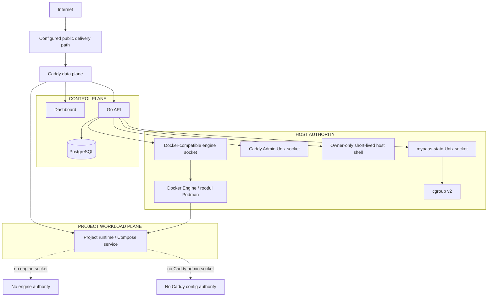
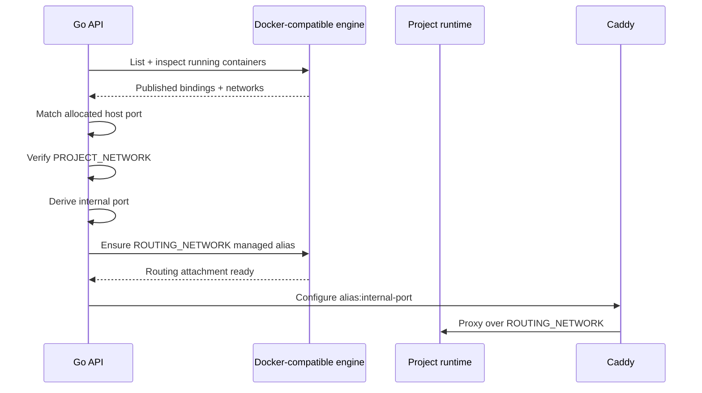

# MyPaaS Security Boundaries

> Current trust model for the single-host production architecture.

**Status:** Current  
**Applies to:** `main`  
**Last verified:** 2026-08-28  
**Verified against commit:** `e12f47dd3249e2fdd69df352852ff3c9c3489245`

---

## Security model in one diagram



The core rule is simple: project workloads are restricted, but the API itself is privileged because it controls the container engine.

## Owner-only host shell

The `/shell` dashboard page and `/admin/shell/*` API are available only after authentication and the existing `RequireOwner` check. Every whitelisted account is an owner; the first account by registration order is the master account and cannot be removed. Owner accounts cannot remove other owner accounts.

The shell process runs on the MyPaaS host and therefore must be treated as host authority, not as an isolated project terminal. Sessions expire after 30 minutes and stop after 10 minutes of inactivity. Shell input is deliberately excluded from audit metadata because it may contain secrets; session start and stop remain auditable. This feature does not add public SSH, raw TCP forwarding, or a shell inside a project workload.

## Container-engine socket

The API mounts the configured Docker-compatible engine socket because deployment orchestration, lifecycle, inspection, logs, metrics fallback, image management, Compose operations, and route resolution require engine authority.

Production normalizes the selected host socket into the API container at:

```text
/var/run/docker.sock
```

On a fresh rootful Podman host, the canonical host socket is normally `/run/podman/podman.sock`; Docker Engine compatibility uses `/var/run/docker.sock`. The production deploy helper resolves a live host socket and maps it to the stable in-container path.

Access to that socket is effectively host-level container-engine authority. An API compromise must therefore be treated as compromise of the MyPaaS host boundary.

The production API container still reduces ambient privilege:

- it is exposed on host loopback rather than a public host interface;
- it joins only `CONTROL_NETWORK`;
- it uses `no-new-privileges:true`;
- it drops all Linux capabilities;
- it never passes the engine socket to project workloads.

Those controls matter, but they do not turn the engine socket into a low-privilege interface.

A socket proxy is intentionally not part of the current architecture. Introducing one would create another privileged component and authorization surface.

## Network separation

Production uses three distinct external networks:

| Network | Members | Security intent |
| --- | --- | --- |
| `CONTROL_NETWORK` | API, dashboard, cloudflared, PostgreSQL, Caddy | Platform communication |
| `PROJECT_NETWORK` | Project workloads, PostgreSQL | Workload communication + optional shared DB |
| `ROUTING_NETWORK` | Caddy + explicitly routed runtimes/services | Narrow public HTTP application data plane |

The API, dashboard, and cloudflared do not join the project network. Caddy does not join the general project network. A runtime/service receives routing-network membership only as part of an explicit public route.

PostgreSQL is intentionally dual-homed on control + project because shared PostgreSQL provisioning is an explicit platform feature.

The three network names must remain distinct; production verification checks the expected topology.

## Primary route resolution

For normal container-backed primary routes, the allocated host port remains a stable runtime lookup key rather than the normal Caddy data path.



Route resolution is fail-closed. MyPaaS does not silently fall back to an arbitrary host address when the expected runtime cannot be validated.

## Bounded additional Compose HTTP routes

Compose projects may declare up to four additional HTTP routes under ADR-023.

Security constraints are part of the route contract:

- Compose only;
- target service must exist in the resolved Compose model;
- target TCP port must be explicitly declared through `ports` or `expose`;
- hostname is platform-derived as `<project>-<route>.<PUBLIC_DOMAIN>`;
- no additional host port is allocated or published;
- routing uses `ROUTING_NETWORK` and internal container ports;
- no raw TCP, SSH, UDP, arbitrary custom hostname, or generic port forwarding;
- project workloads never receive the Caddy Admin socket.

If an additional route targets the already-routed primary container, MyPaaS can reuse its managed routing attachment. If it targets another eligible Compose service, only that service receives the routing-network attachment needed for the route.

The route contract is immutable after first deployment in the current version. Host-label ownership checks prevent one project or route from silently replacing another project's Caddy hostname.

Lifecycle reconciliation removes routes when a project stops and recreates missing declared routes for eligible running projects. Project deletion removes the routes and persisted route configuration.

## Caddy administration

Production Caddy administration is Unix-socket only:

```text
/run/mypaas/caddy-admin.sock
```

There is no production mapping for TCP port `2019`.

The API and Caddy share `/run/mypaas`; project workloads do not receive that host mount. A routed workload can share the routing-network application data plane without gaining access to Caddy's privileged configuration plane.

## Untrusted Compose input

Repository Compose files are not executed as trusted configuration. MyPaaS renders the final Compose model, evaluates it against the platform isolation policy, strips repository-defined host ports/container names, and then applies a MyPaaS-managed runtime override.

The policy rejects host-escape or platform-bypass features including:

- privileged mode;
- host/container namespace sharing;
- Docker/Podman socket mounts;
- host bind mounts;
- devices and GPUs;
- added Linux capabilities;
- custom runtimes;
- external networks and external volumes;
- unsafe build entitlements;
- build SSH and build secrets;
- privileged lifecycle hooks.

Safe engine-managed named volumes are allowed by Compose sanitization. VM migration has a separate portability preflight and can reject engine-managed named/external volume state rather than pretending it can be moved safely between engines.

Compose subprocesses receive a fail-closed host-environment allowlist. Project variables are passed through generated project env files instead of inheriting arbitrary control-plane credentials from the API process.

This is a bounded single-host isolation policy. It is not equivalent to VM, microVM, or hostile multi-tenant sandboxing.

## Registry credentials

Image-mode deployments may use one optional installation-level credential for a configured registry host.

The authenticated pull path:

- matches the requested image registry host before applying credentials;
- uses an isolated temporary Docker configuration;
- does not modify the operator's persistent Docker credential store;
- does not inject those credentials into project Compose environments.

This is not a general secrets broker, multi-registry credential manager, registry proxy, cache, or mirror.

## GitHub repository credentials

The connected GitHub account can be used to list repositories in the New Project picker and to access private GitHub sources during inspection, deployment, and rollback.

The repository access token:

- is stored encrypted in the control-plane database;
- is used only by control-plane GitHub API requests and Git subprocesses for GitHub HTTPS URLs;
- is attached to a Git operation through a process-scoped HTTP authorization configuration rather than command arguments;
- is not written to a repository's Git configuration, passed to project workloads, or included in build/deployment logs.

The current OAuth integration requests GitHub's `repo` scope so trusted administrators can use private repositories. This grants broader repository permission than a read-only GitHub App token; narrowing that permission is a future authentication-boundary improvement.

## Native telemetry daemon

`mypaas-statd` is host-native by design. It reads bounded cgroup/host telemetry and exposes it over `/run/mypaas/statd.sock`.

The API receives the statd socket directory but does not receive raw host `/proc` or cgroup mounts. Runtime-statd failure is non-fatal and falls back to the Docker-compatible metrics path.

## Data boundary

PostgreSQL stores MyPaaS control-plane state and can optionally provision project-specific shared databases/users. Because PostgreSQL is reachable from `PROJECT_NETWORK`, the security model includes database credentials and PostgreSQL authorization, not network isolation alone.

Persisted environment variables are encrypted before storage. Secrets must not be treated as safe merely because the database is on a private network.

## Trust assumptions

The current production target is:

- one administrative owner; or
- a small trusted team deploying workloads to one host.

The current design should **not** be described as suitable for arbitrary mutually hostile tenants.

Before that claim would be defensible, stronger isolation would be required, potentially including per-tenant VM/microVM boundaries, stronger database isolation, stricter host resource governance, and a narrower engine-authority surface.

## Security invariants

The following properties are part of the current production contract:

- project workloads do not receive the engine socket;
- project workloads do not receive the Caddy Admin socket;
- the API does not join project or routing networks;
- Caddy does not join the general project network;
- only explicitly routed runtimes/services gain routing-network membership;
- additional Compose HTTP routes do not publish extra host ports;
- production Caddy Admin is Unix-socket only;
- Compose policy rejects known host-escape features before execution;
- route resolution fails closed;
- host-label ownership is checked for primary and additional project routes;
- statd does not require mounting host cgroups into the API container;
- engine authority remains explicitly documented as host authority.

## Qualification boundary

The PR #157 qualification on VM `172.104.61.180` proved the bounded additional-route behavior at exact candidate head `b35176fd0156c8128e988a2ce3a46693a150c61d`, including absence of an additional `9001` host publication and correct route reconciliation/cleanup.

That qualification confirms the declared routing contract in the tested scenario. It does not change the trust assumptions above or establish VM-grade tenant isolation.

See `docs/engineering/beta-readiness-gates.md` and ADR-023 for qualification provenance.

## Related documents

- [Networking and trust boundaries](architecture/networking.md)
- [Architecture overview](architecture/overview.md)
- [Deployment architecture](architecture/deployment.md)
- [Observability architecture](architecture/observability.md)
- [mypaas-statd integration](STATD.md)
- [ADR-022: bounded private-registry authentication](adr/ADR-022-private-registry-auth.md)
- [ADR-023: bounded additional Compose HTTP routes](adr/ADR-023-compose-additional-http-routes.md)
- [ADR-024: GitHub repository picker and private-source access](adr/ADR-024-github-repository-access.md)
