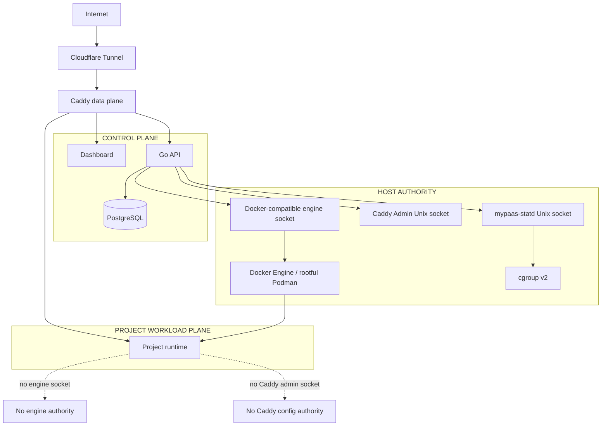
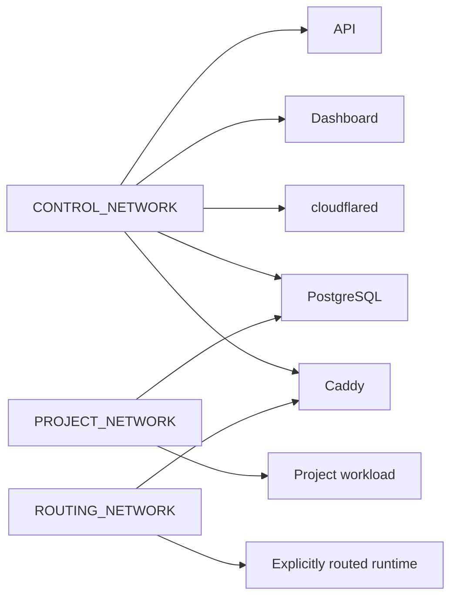
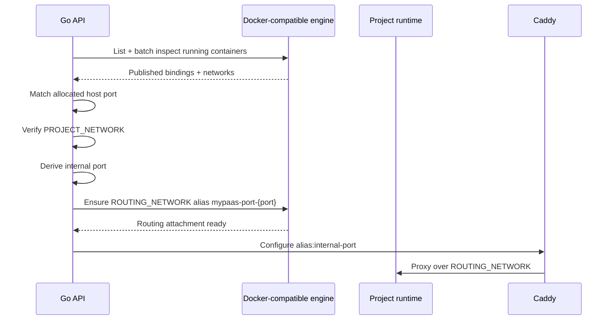

# MyPaaS Security Boundaries

> Current trust model for the single-host production architecture.

**Status:** Current  
**Applies to:** `main`  
**Last verified:** 2026-08-13  
**Verified against commit:** `f76102997089a3f1a3b5e7d9f4326582ff22e02c`

---

## Security model in one diagram



The core rule is simple: project workloads are restricted, but the API itself is privileged because it controls the container engine.

## Container-engine socket

The API mounts the configured Docker-compatible engine socket because deployment orchestration, lifecycle, inspection, logs, metrics fallback, image management, Compose operations, and route resolution require engine authority.

Access to that socket is effectively host-level container-engine authority. An API compromise must therefore be treated as compromise of the MyPaaS host boundary.

The production API container still reduces ambient privilege:

- it is exposed on host loopback rather than a public host interface;
- it joins only `CONTROL_NETWORK`;
- it uses `no-new-privileges:true`;
- it drops all Linux capabilities;
- it never passes the engine socket to project workloads.

Those controls matter, but they do not turn the engine socket into a low-privilege interface.

A socket proxy is intentionally not part of the current architecture. Introducing one would create another privileged component and a new authorization surface. That choice should be revisited only if the orchestration engine can be reduced to a small, auditable API subset.

## Network separation

Production uses three distinct external networks:

| Network | Members | Security intent |
| --- | --- | --- |
| `CONTROL_NETWORK` | API, dashboard, cloudflared, PostgreSQL, Caddy | Platform communication |
| `PROJECT_NETWORK` | Project workloads, PostgreSQL | Workload communication + optional shared DB |
| `ROUTING_NETWORK` | Caddy + explicitly routed runtimes | Narrow public application data plane |



The API, dashboard, and cloudflared do not join the project network. Caddy does not join the general project network. A runtime receives routing-network membership only as part of explicit route activation.

PostgreSQL is intentionally dual-homed on control + project because shared PostgreSQL provisioning is an explicit platform feature.

The three network names must remain distinct; production verification checks the expected topology.

## Runtime route resolution

Production uses `CADDY_UPSTREAM_HOST=runtime`.

The allocated host port is a stable runtime lookup key, not the normal Caddy data path.



Explicit network aliases are used instead of compatibility-layer container IP fields or container-name assumptions. If the runtime is already attached to the routing network without the expected alias, MyPaaS refreshes only that secondary attachment.

Route resolution is fail-closed. MyPaaS does not silently fall back to an arbitrary host address when the expected runtime cannot be validated.

## Caddy administration

Production Caddy administration is Unix-socket only:

```text
/run/mypaas/caddy-admin.sock
```

There is no production mapping for TCP port `2019`.

The API and Caddy share `/run/mypaas`; project workloads do not receive that host mount. This separates Caddy's privileged configuration plane from its normal HTTP data plane.

A routed workload can share `ROUTING_NETWORK` with Caddy's application listener without gaining access to the Caddy Admin socket.

## Untrusted Compose input

Repository Compose files are not executed as trusted configuration. MyPaaS renders the final Compose model, evaluates it against the platform isolation policy, strips repository-defined host ports/container names, and then applies a MyPaaS-managed runtime override.

The policy rejects host-escape or platform-bypass features including:

- privileged mode;
- host/container namespace sharing;
- Docker/Podman socket mounts;
- host bind mounts;
- devices and GPUs;
- added Linux capabilities;
- custom runtimes;
- external networks and external volumes;
- unsafe build entitlements;
- build SSH and build secrets;
- privileged lifecycle hooks.

Safe engine-managed named volumes are allowed by Compose sanitization. VM migration has a separate portability preflight and can reject engine-managed named/external volume state rather than pretending it can be moved safely between engines.

Compose subprocesses receive a fail-closed host-environment allowlist. Project variables are passed through generated project env files instead of inheriting arbitrary control-plane credentials from the API process.

This is an important single-host isolation boundary. It is not equivalent to VM, microVM, or Kubernetes multi-tenant sandboxing.

## Native telemetry daemon

`mypaas-statd` is host-native by design. It reads cgroup v2 and host telemetry and exposes a bounded protocol over `/run/mypaas/statd.sock`.

The API receives the statd socket directory but does not receive host `/proc` or `/sys/fs/cgroup` mounts. This keeps raw host telemetry access out of the API container while avoiding a privileged telemetry sidecar.

Runtime-statd failure is non-fatal and falls back to the Docker-compatible metrics path. Host telemetry is optional: capacity/allocation remain available while `telemetry_status` and `telemetry_error_code` expose whether live host telemetry is disabled, unavailable, or available.

## Data boundary

PostgreSQL stores MyPaaS control-plane state and can optionally provision project-specific shared databases/users. Because PostgreSQL is reachable from `PROJECT_NETWORK`, the security model includes database credentials and PostgreSQL authorization, not network isolation alone.

Persisted environment variables are encrypted before storage. Secrets must not be treated as safe merely because the database is on a private network.

## Trust assumptions

The current production target is:

- one administrative owner; or
- a small trusted team deploying workloads to one host.

The current design should **not** be described as suitable for arbitrary mutually hostile tenants.

Before that claim would be defensible, additional isolation would be required, potentially including per-tenant VM/microVM boundaries, stronger database isolation, stricter host resource governance, and a narrower engine-authority surface.

## Security invariants

The following properties are part of the current production contract:

- project workloads do not receive the engine socket;
- project workloads do not receive the Caddy Admin socket;
- the API does not join project or routing networks;
- Caddy does not join the general project network;
- only explicitly routed runtimes gain routing-network membership;
- production Caddy Admin is Unix-socket only;
- Compose policy rejects known host-escape features before execution;
- route resolution fails closed;
- statd does not require mounting host cgroups into the API container;
- engine authority remains explicitly documented as host authority.

## Related documents

- [Networking and trust boundaries](architecture/networking.md)
- [Architecture overview](architecture/overview.md)
- [Deployment architecture](architecture/deployment.md)
- [Observability architecture](architecture/observability.md)
- [mypaas-statd integration](STATD.md)
