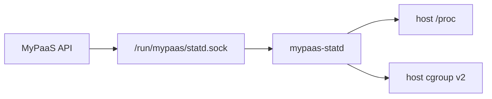
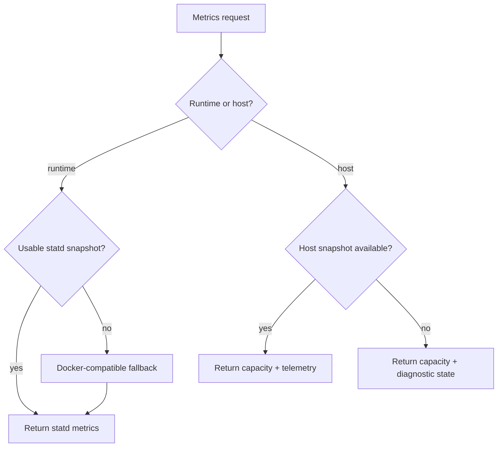

# mypaas-statd Integration

`mypaas-statd` is an optional Linux-native telemetry daemon used by MyPaaS for runtime and host metrics.

## Role



The daemon runs under systemd on the host. The API communicates with it through a Unix socket instead of mounting host `/proc` or `/sys/fs/cgroup` into the API container.

`mypaas-statd` is optional. Runtime metrics fall back to the Docker-compatible engine path when statd is disabled, unavailable, or unusable for a runtime.

## Installation

Production installation uses a versioned release artifact and checksum. Source installation remains available explicitly for development, forks, or unsupported prebuilt architectures.

Typical settings:

```text
STATD_INSTALL_MODE=release
STATD_VERSION=<supported-release>
STATD_RELEASE_BASE_URL=https://github.com/nabilrn/mypaas-statd/releases/download
STATD_SOCKET=/run/mypaas/statd.sock
```

The current production installer defaults to statd release installation. Set `INSTALL_STATD=false` before installation to skip statd.

The prebuilt release path used by the installer is currently `linux-amd64`; other architectures require an explicit supported source-install workflow or statd disabled.

## Operations

Check the host service:

```bash
systemctl status mypaas-statd
```

Inspect service logs:

```bash
journalctl -u mypaas-statd
```

Confirm the socket exists:

```bash
test -S /run/mypaas/statd.sock && echo "statd socket ready"
```

Reconcile the host daemon against the current MyPaaS checkout/configuration:

```bash
cd ~/MyPaas
ENV_FILE=.env bash scripts/reconcile-statd.sh
```

The platform updater performs this reconciliation automatically as part of its normal host dependency path.

After installing, repairing, or reconciling statd, verify the complete production boundary:

```bash
cd ~/MyPaas
ENV_FILE=.env bash scripts/verify-production.sh
```

If `STATD_SOCKET` is configured, production verification requires the service to be active, the host socket to exist, and the socket to be visible inside the API container.

Do not treat statd failure as proof that application runtimes are down. Runtime metrics can fall back to the Docker-compatible engine path; host telemetry has a separate diagnostic state.

## Protocol

The current client uses protocol 1 over the Unix socket. Runtime identifiers use:

```text
<project-uuid>:<service-name>
```

The client uses bounded exchange timeouts and rejects incompatible protocol responses.

## Runtime metrics

Runtime snapshots expose cgroup-derived CPU, memory, and PID information together with validity/staleness state. The protocol does not currently expose a sampler timestamp, so the UI and documentation must not invent metric-age guarantees.

MyPaaS keeps bounded runtime identity metadata so steady-state metrics collection does not require repeated process discovery. Stale or invalid runtime identity is rediscovered when needed.

Project Detail metrics are sampled through a shared per-project hub and fanned out to subscribers over SSE. Browser subscriber count therefore does not directly multiply runtime sampling loops.

## Host telemetry

Supported statd releases can also expose host CPU, memory, storage, and network counters to the admin host-stats view. Host sections are optional.

The API preserves configured capacity/allocation information when host telemetry is unavailable; it does not fabricate host filesystem or network information from the API container namespace.

Network values exposed by the daemon are cumulative counters. Rate charts must derive rates from successive successful snapshots and elapsed time.

## Failure behavior



Runtime statd failure is non-fatal because the engine fallback remains available. Host telemetry failure returns a diagnostic state rather than invented values.

Prometheus-compatible signals include statd availability, fallback count, snapshot errors, and registration errors.

## Performance measurement

The `mypaas-statd` repository contains local tooling for comparing implementation paths. Generated benchmark output is engineering evidence for a specific run only. It is not a MyPaaS application-capacity claim and is intentionally not reproduced in this product documentation.

## Related documents

- [Observability architecture](architecture/observability.md)
- [Architecture overview](architecture/overview.md)
- [Production verification](operations/production-verification.md)
- [Updates](operations/update.md)
- [Security boundaries](SECURITY_BOUNDARIES.md)
