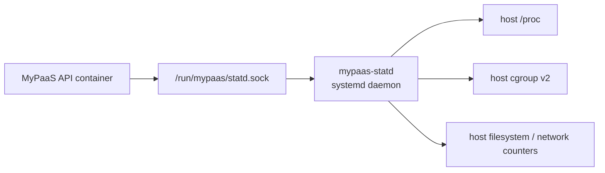
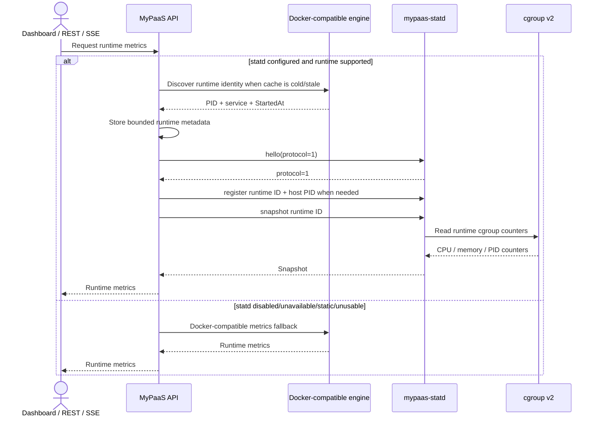
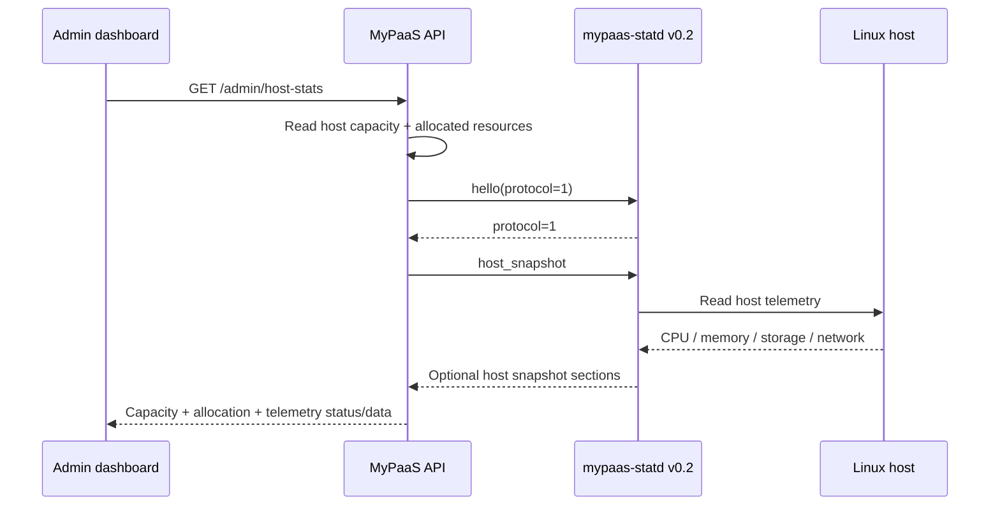
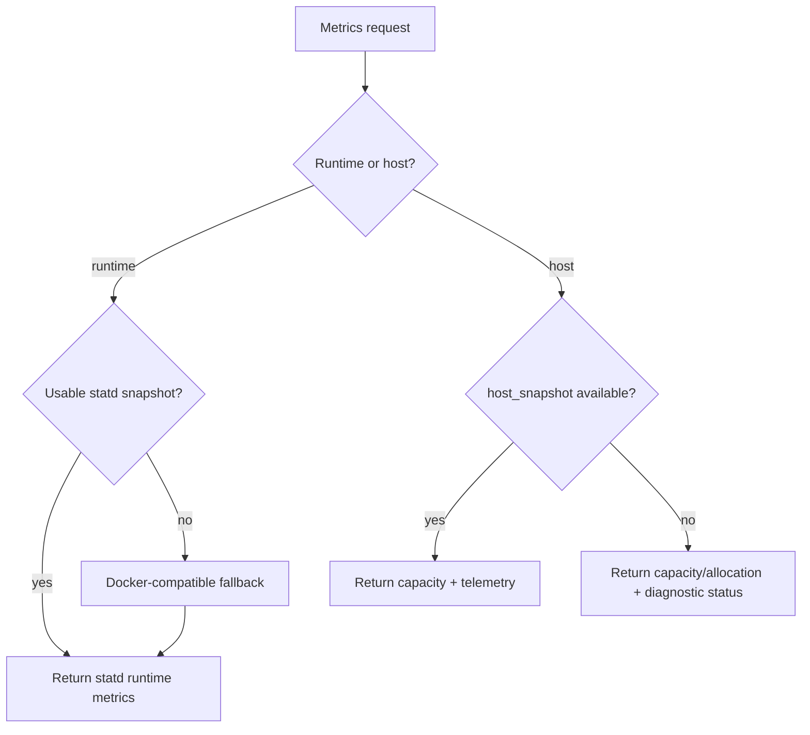

# mypaas-statd Integration

> Host-native runtime and host telemetry integration for MyPaaS.

**Status:** Current  
**Applies to:** `main`  
**Last verified:** 2026-08-13  
**Verified against commit:** `f76102997089a3f1a3b5e7d9f4326582ff22e02c`  
**Current production statd release:** `v0.2.0`

---

## Role in the architecture

`mypaas-statd` is the preferred runtime metrics path for live Dockerfile and Compose projects when `STATD_SOCKET` is configured. Since v0.2.0 it also provides optional host CPU, memory, storage, and network telemetry for the admin host-stats view.

It is intentionally a **host-native systemd daemon**:



The API receives the Unix socket but does not mount host `/proc` or `/sys/fs/cgroup`. statd is not a control-plane container and is not distributed as a required GHCR sidecar.

## Production installation

Production installation is pinned to a release, not mutable `main`.

Current installer defaults:

```text
STATD_INSTALL_MODE=release
STATD_VERSION=v0.2.0
STATD_RELEASE_BASE_URL=https://github.com/nabilrn/mypaas-statd/releases/download
STATD_SOCKET=/run/mypaas/statd.sock
```

The published v0.2.0 release provides:

```text
mypaas-statd-linux-amd64.tar.gz
SHA256SUMS
```

The installer downloads the artifact and checksum file, requires an exact checksum entry, verifies it with `sha256sum -c`, extracts the release, verifies the bundled version, installs the binary/systemd unit, enables the service, and waits for `/run/mypaas/statd.sock`.

Set:

```text
INSTALL_STATD=false
```

to skip statd and keep the Docker-compatible runtime metrics path only.

### Explicit source mode

Source installation remains available for development, forks, and unsupported prebuilt architectures:

```text
STATD_INSTALL_MODE=source
STATD_REPO_URL=https://github.com/nabilrn/mypaas-statd.git
STATD_REF=<branch-tag-or-commit>
STATD_DIR=/opt/mypaas-statd
```

Source mode is explicit. It is not the default production distribution model.

## Compatibility contract

The MyPaaS client currently negotiates **protocol 1** on each Unix connection.

| statd release | Protocol | Runtime snapshots | Host snapshot | Production status |
| --- | --- | --- | --- | --- |
| `v0.1.0` | 1 | Yes | No | Historical/upgrade compatibility |
| `v0.2.0` | 1 | Yes | Yes | Current installer default |

`host_snapshot` is additive within protocol 1. Runtime snapshot compatibility therefore remains stable across v0.1 and v0.2, while host telemetry is available only from a daemon that implements the new operation.

The MyPaaS client has a bounded exchange timeout and rejects protocol mismatches instead of interpreting incompatible payloads.

## Runtime metrics flow



Runtime IDs use:

```text
<project-uuid>:<service-name>
```

Example:

```text
784283cd-0b53-42eb-bd9a-e1c729e86f41:app
```

The steady-state path avoids repeated Docker/Podman process-discovery spawns. A cached runtime identity is invalidated and rediscovered when it becomes unusable.

## Runtime snapshot model

Protocol 1 runtime snapshots expose:

- CPU usage counter and optional computed percentage/quota data;
- current/max memory plus OOM/OOM-kill counters;
- current/max PID counters;
- snapshot validity/staleness flags.

Protocol 1 runtime snapshots do not expose a sampler timestamp. Documentation and UI must not claim metric age/freshness that the protocol does not provide.

## Host telemetry flow

v0.2.0 adds `host_snapshot`.



Current host snapshot structures include:

```text
memory.total_bytes
memory.available_bytes
cpu.total_ticks
cpu.idle_ticks
storage.total_bytes
storage.available_bytes
network.interface
network.rx_bytes
network.tx_bytes
```

Network values are cumulative counters, not bytes-per-second. Rate charts must derive rates from successive successful snapshots and elapsed time.

Host sections are nullable. The API still returns capacity/allocation fields when telemetry is disabled or unavailable.

Current diagnostic states:

```text
telemetry_status = disabled | unavailable | available
telemetry_error_code = <optional stable category>
```

The API intentionally does not read host storage/network data from its own container namespace as a fallback.

## Failure and fallback behavior



Runtime statd failure is non-fatal because a Docker-compatible fallback exists. Host telemetry is different: MyPaaS preserves capacity/allocation but does not fabricate host telemetry from the API container.

## Operational visibility

Runtime statd availability/fallback is exposed through low-cardinality Prometheus metrics:

```text
mypaas_statd_available
mypaas_statd_fallback_total
mypaas_statd_snapshot_errors_total
mypaas_statd_registration_errors_total
```

Logging for runtime fallback is transition-aware:

- first unavailable state or healthy → unavailable transition: warning;
- repeated fallback while already unavailable: debug;
- unavailable → healthy recovery: info.

When `STATD_SOCKET` is configured, `scripts/verify-production.sh` also requires the host systemd service to be active, the Unix socket to exist, and the API container to see the mounted socket.

## Historical benchmark evidence

The accepted Phase 4 real-host runtime benchmark evidence remains in the `nabilrn/mypaas-statd` repository:

```text
benchmarks/results/phase4-debian13-podman-2026-08-10/
```

Tested statd commit:

```text
cf8843545ea19ecf9a54049e21b2fe609e49d58d
```

Environment:

- Debian GNU/Linux 13;
- kernel `6.12.88+deb13-amd64`;
- rootful Podman 5.4.2;
- `/var/run/docker.sock` backed by Podman;
- 50 warmup samples;
- 500 recorded iterations per trial;
- three trials.

Recorded runtime-path results:

| Trial | Path | p50 ms | p95 ms | p99 ms | Process spawns |
| --- | --- | ---: | ---: | ---: | ---: |
| 1 | Docker-compatible CLI | 41.0394 | 51.9852 | 57.2799 | 500 |
| 1 | statd | 0.7803 | 0.8813 | 1.0528 | 0 |
| 2 | Docker-compatible CLI | 41.5558 | 53.6186 | 64.3199 | 500 |
| 2 | statd | 0.7969 | 1.0065 | 1.1074 | 0 |
| 3 | Docker-compatible CLI | 43.2664 | 55.9937 | 64.0453 | 500 |
| 3 | statd | 0.8202 | 1.0882 | 1.2006 | 0 |

Correctness checks compared statd snapshots with raw cgroup v2 files for memory, PID, and CPU counter semantics. Runtime disappearance was also exercised and returned `NOT_FOUND` while the daemon remained active.

These results are historical evidence for the runtime snapshot path. They are not a fresh benchmark of v0.2.0 host telemetry and should not be generalized to every machine.

## Release model

The supported distribution order remains:

1. versioned GitHub Release artifact + `SHA256SUMS` for production;
2. explicit source installation for development/forks/unsupported prebuilt architectures;
3. additional OS packaging only if operational maturity justifies it.

MyPaaS API/dashboard remain container images. statd remains a host tool consumed through `STATD_SOCKET`.

## Related documents

- [Observability architecture](architecture/observability.md)
- [Architecture overview](architecture/overview.md)
- [Security boundaries](SECURITY_BOUNDARIES.md)
