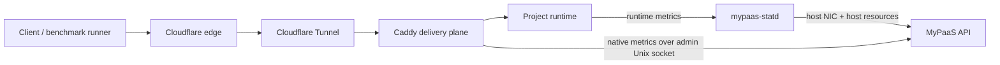

# Delivery Path Observability

MyPaaS tracks application compute and public delivery as separate signals. CPU
and memory can stay low while users still see slow pages because of large
responses, proxy latency, connection pressure, tunnel behavior, CDN cache
misses, or the external network path.



## Telemetry Boundary

### Host and runtime

`mypaas-statd` reports host and project-runtime telemetry:

- host CPU and memory
- host storage
- host network RX/TX cumulative counters
- project CPU, memory, PID, and OOM-related runtime snapshots

The dashboard derives host network throughput from successive RX/TX counter samples.

### Caddy delivery plane

Caddy native Prometheus metrics are enabled for the `:80` HTTP server and
scraped through the existing private Admin Unix socket. MyPaaS does not add a
public metrics port or a separate metrics service.

Caddy instruments middleware handlers individually. One request can appear in
multiple handler series as it passes through `subroute`, headers, encoding, and
the terminal delivery handler. MyPaaS aggregates only the terminal handlers used
by project routes: `reverse_proxy` and `file_server`.

The owner-only delivery snapshot exposes low-cardinality counters and
histograms. The dashboard uses consecutive samples to derive:

- terminal delivery requests per second
- terminal delivery requests in flight
- request-duration p95
- response TTFB p95
- response-body bytes per second
- HTTP 5xx share
- terminal-handler middleware error rate
- reverse-proxy upstream health, when exported by Caddy

These values are platform-wide for Caddy server `srv0`. They are diagnostic
signals, not per-project billing metrics. Requests handled by another terminal
Caddy module must be added deliberately; they are not mixed into the totals by
default.

Caddy metrics can add overhead on very busy servers. Treat delivery telemetry as
a diagnostic feature and measure its overhead during qualification.

## Interpreting the layers

Compare signals across layers instead of treating one metric as proof of the
bottleneck:

```text
High app CPU + high Caddy latency
  -> investigate application/runtime capacity first

Low app CPU + high Caddy latency
  -> investigate proxy/origin behavior

Low Caddy latency + high public/client latency
  -> investigate edge, tunnel, or external network path

High host TX + high Caddy response-body rate
  -> origin is actively transferring substantial response data

Low Caddy response-body rate + high host TX
  -> inspect non-Caddy/tunnel/platform traffic and protocol overhead
```

Caddy response-body bytes and host NIC TX are different measurements. NIC
traffic includes tunnel/protocol overhead and other host traffic.

## Cloudflare boundary

Cloudflare cache status, edge behavior, and Tunnel connector health are outside
Caddy origin metrics. Correlate them during benchmarks; do not infer them from
Caddy counters.

A controlled experiment may compare one, two, and four Cloudflare Tunnel
connectors by setting `CLOUDFLARE_TUNNEL_CONNECTORS` to `1`, `2`, or `4`.
The default is `1`. Connector replication should become a broader platform
feature only if repeatable benchmark evidence shows connector count is a
material bottleneck.

## Replica boundary

Application replicas and Caddy upstream load balancing are future scale-out
features. Do not introduce them only because public page latency is high.
Replica work is justified after cache behavior, benchmark runner limits,
edge/tunnel behavior, and proxy behavior have been isolated and the project
runtime is still the constrained layer.

## Evidence hygiene

Keep raw k6 output, raw Caddy logs, screenshots, tokens, cookies, and
environment files outside the repository. Commit only sanitized methodology,
scripts, and summarized results tied to exact application and MyPaaS revisions.
