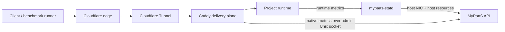

# Delivery Path Observability

> Separating application compute pressure from public request-delivery pressure.

## Why this exists

CPU and memory utilization do not describe the full serving capacity of a web platform. A project can remain well below its CPU and RAM limits while page delivery degrades because of response size, proxy latency, connection pressure, tunnel behavior, CDN cache misses, or external network constraints.

MyPaaS therefore treats compute and delivery as separate observable planes:



## Current telemetry boundary

### Host and runtime

`mypaas-statd` remains responsible for host and project-runtime telemetry, including:

- host CPU and memory;
- host storage;
- host network RX/TX cumulative counters;
- project CPU, memory, PID and OOM-related runtime snapshots.

The dashboard derives host network throughput from successive RX/TX counter samples.

### Caddy delivery plane

Caddy native Prometheus metrics are enabled through the existing private Admin Unix socket. MyPaaS does not add a public Caddy metrics port or another metrics service.

The owner-only delivery snapshot exposes low-cardinality aggregate counters/histograms used by the dashboard to derive short-interval values:

- requests per second;
- requests in flight;
- request-duration p95;
- response TTFB p95;
- response-body bytes per second;
- HTTP 5xx share;
- Caddy middleware error rate;
- reverse-proxy upstream health when exported by Caddy.

These values are platform-wide for Caddy server `srv0`. They are diagnostic signals, not per-project billing metrics.

## Interpreting the layers

The dashboard should compare the signals instead of treating any one metric as the bottleneck:

```text
High app CPU + high Caddy latency
  -> investigate application/runtime capacity first

Low app CPU + high Caddy latency
  -> investigate proxy/origin behavior

Low Caddy latency + high public/client latency
  -> investigate edge, tunnel, or external network path

High host TX + high Caddy response-body rate
  -> origin is actively transferring substantial response data

Low Caddy response-body rate + high host TX
  -> inspect non-Caddy/tunnel/platform traffic and protocol overhead
```

Caddy response-body bytes and host NIC TX are intentionally different measurements. NIC traffic includes tunnel/protocol overhead and other host traffic.

## Cloudflare boundary

Cloudflare cache status, edge behavior, and Tunnel connector health are separate from Caddy origin metrics. They should be correlated during benchmarks but must not be inferred from Caddy counters.

A future controlled performance experiment may compare one, two, and four Cloudflare Tunnel connectors. Connector replication should only become a permanent platform option if repeatable benchmark evidence shows that connector count is a material bottleneck.

## Replica boundary

Application replicas and Caddy upstream load balancing are future scale-out features. They should not be introduced merely because public page latency is high. Replica work is justified only after evidence shows the project runtime/origin is the constrained layer after cache, runner, edge/tunnel, and proxy behavior have been isolated.

## Evidence hygiene

Performance qualification keeps raw k6 output, raw Caddy logs, screenshots, tokens, cookies, and environment files outside the repository. Commits should contain only sanitized methodology, scripts, and summarized results tied to exact application/MyPaaS revisions.
