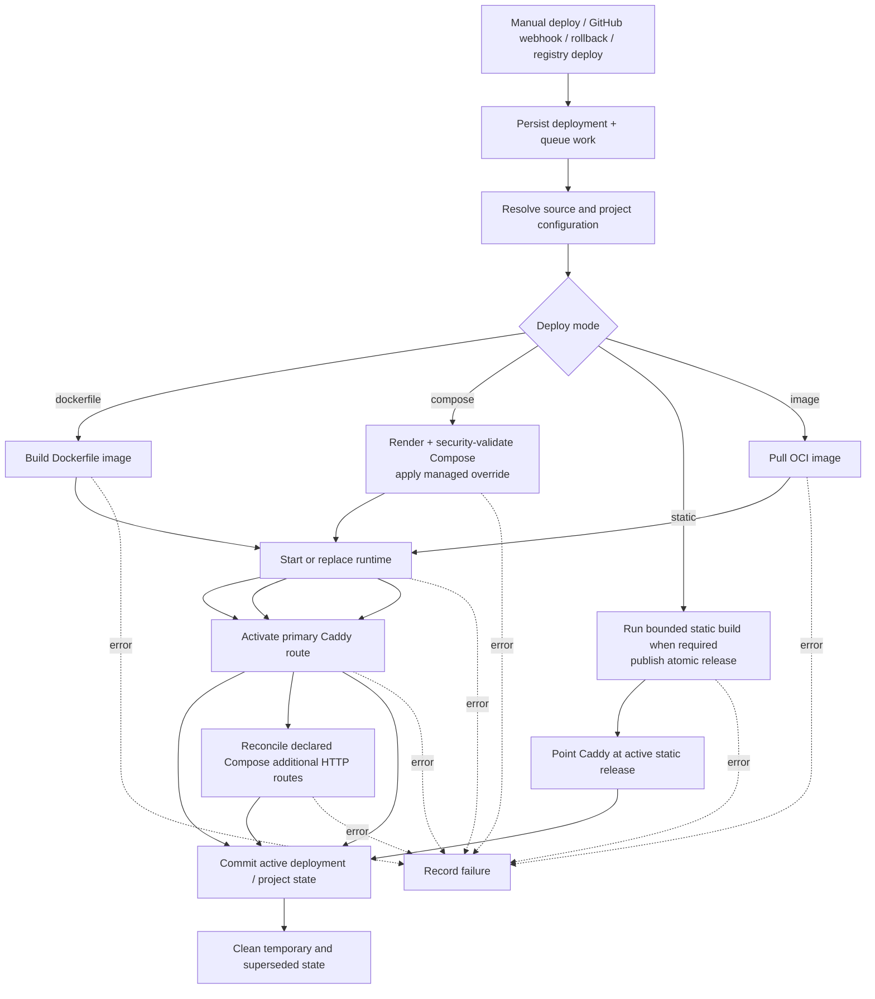
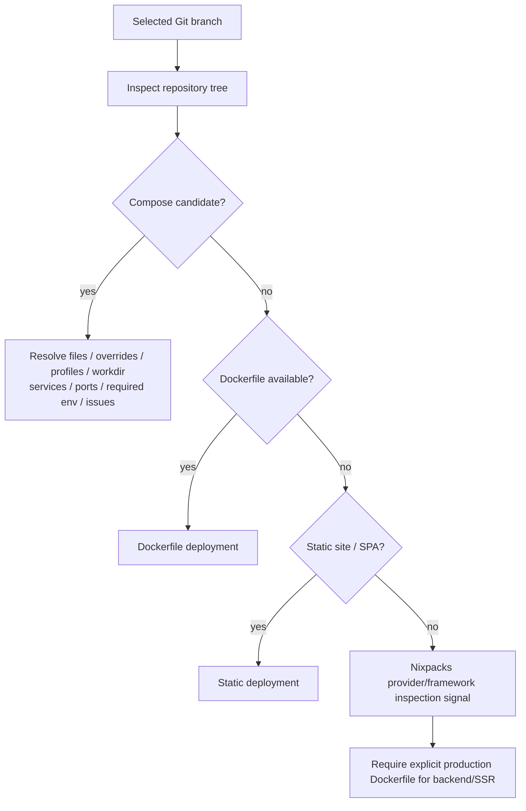
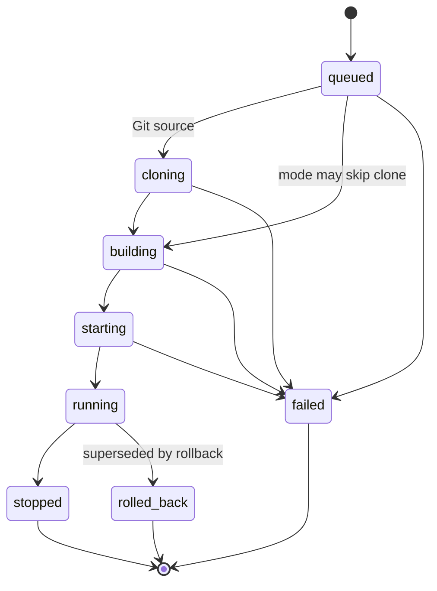
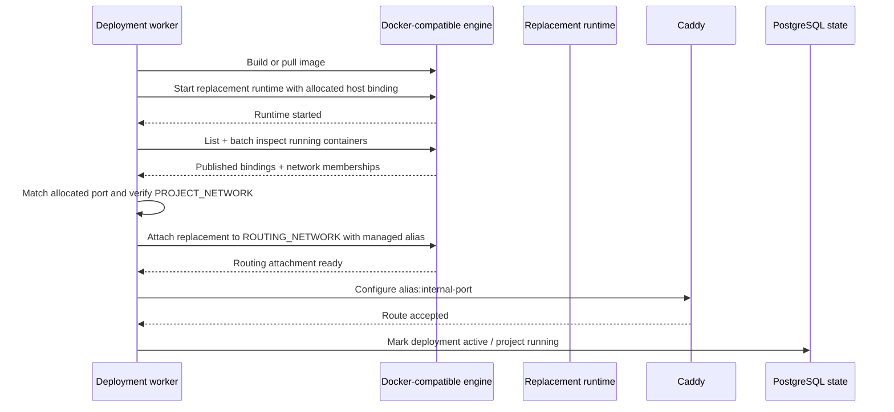
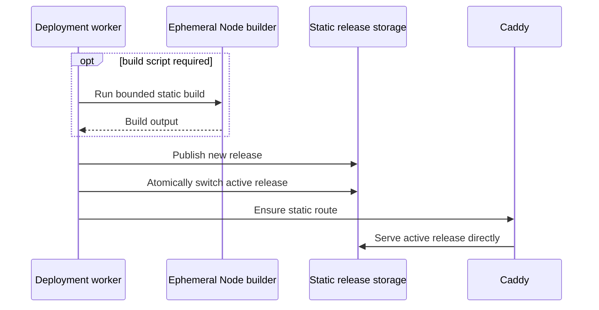

# Deployment Architecture

> Source inspection, deployment execution, lifecycle state, and public route activation.

**Status:** Current  
**Applies to:** `main`  
**Last verified:** 2026-08-28  
**Verified against commit:** `e12f47dd3249e2fdd69df352852ff3c9c3489245`

---

## Supported deployment modes

| Source | Deploy mode | Execution model | Historical rollback |
| --- | --- | --- | --- |
| Git | `dockerfile` | Build repository Dockerfile, start managed runtime, activate route | Yes |
| Git | `compose` | Render/validate Compose, apply MyPaaS override, start services, activate primary + declared additional HTTP routes | Yes |
| Git | `static` | Build when needed, publish static release, serve directly with Caddy | Redeploy/roll-forward |
| Registry | `image` | Pull OCI image, start managed runtime, activate route | Yes |

Nixpacks is an inspection signal, not a deployment mode. A backend/SSR repository without Compose or a production Dockerfile is not silently turned into an opaque generated runtime.

## Registry image pulls

Image-mode deployments pull anonymously by default.

An installation may configure one bounded registry credential through the ADR-022 contract. The credential is used only when the requested image host matches the configured registry. Authenticated pulls use an isolated temporary Docker configuration so the operator's persistent Docker credentials are not modified.

The registry credential does not automatically flow into Compose service pulls. MyPaaS does not provide a registry proxy, mirror, pull-through cache, or general per-project registry credential manager.

## Common pipeline



For Compose deployments, required additional HTTP routes are reconciled synchronously before the deployment is marked `running`. Periodic reconciliation remains a recovery path, not a substitute for initial deployment correctness.

The worker model is intentionally bounded rather than an external distributed scheduler. The platform remains single-host.

## Repository inspection

Project creation and deployment configuration inspect the selected Git source.



Compose is treated as untrusted configuration. The final rendered model is evaluated before execution, and MyPaaS strips repository-defined host ports and container names before applying its managed runtime override.

## Compose execution boundary

The current policy rejects configuration that could bypass the intended host boundary, including:

- privileged containers;
- host/container namespace sharing;
- Docker/Podman socket mounts;
- host bind mounts;
- devices and GPUs;
- added Linux capabilities;
- custom runtimes;
- external networks and external volumes;
- unsafe build entitlements;
- build SSH and build secrets;
- privileged lifecycle hooks.

Safe engine-managed named volumes are allowed by Compose sanitization. Project environment values are passed through generated project env files. Compose subprocesses receive a fail-closed host-environment allowlist rather than inheriting arbitrary API process credentials.

## Compose additional HTTP routes

A Compose project can persist up to four additional HTTP-route entries.

Each entry contains:

- a short route name;
- an existing Compose service name;
- an internal TCP port explicitly declared by that service through `ports` or `expose`.

The public hostname is derived by MyPaaS:

```text
<project>-<route>.<PUBLIC_DOMAIN>
```

The primary route remains:

```text
<project>.<PUBLIC_DOMAIN>
```

Validation re-reads the persisted repository/branch/base-directory/Compose configuration so client template metadata is not trusted as runtime authority.

Hard boundaries:

- Compose only;
- HTTP(S) through Caddy only;
- maximum four additional routes;
- no arbitrary hostnames;
- no additional host-port allocation/publication;
- no raw TCP, SSH, or UDP forwarding;
- route contract immutable after first deployment.

### Data-plane behavior

Additional routes reuse `ROUTING_NETWORK` and internal container ports.

If an additional route targets another port on the already-routed main container, the existing managed routing attachment can be reused. If it targets another eligible Compose service, MyPaaS attaches that service to `ROUTING_NETWORK` with a deterministic managed HTTP-route alias.

The secondary route therefore does not require a new host port.

### Lifecycle behavior

Additional routes are reconciled during:

- initial Compose deployment;
- start/restart/redeploy;
- rollback/Compose reset paths that change runtime state;
- periodic Caddy reconciliation after control-plane interruption;
- stop and project deletion cleanup.

Running projects should have all persisted routes present. Stopped/non-running projects should not keep their public routes active. Deleted projects lose both Caddy routes and persisted additional-route configuration as part of cleanup.

## Deployment status model

The public status vocabulary remains:



Individual deployment modes can skip stages that do not apply. A rollback is an explicit deployment action and remains visible in deployment history/audit behavior.

Project state is a separate model with `pending`, `building`, `running`, `stopped`, and `crashed` states.

## Runtime replacement and primary route activation

Dockerfile and image deployments can replace a runtime while keeping routing identity independent of a stable container name.



The allocated host port is a runtime lookup key for the primary container-backed route, not the normal production data path.

## Static release path

Static projects bypass the application container runtime after any required build step.



For static releases, Caddy preserves real files/directories first and falls back to the release `index.html` for client-side SPA routes.

## Rollback semantics

Dockerfile, Compose, and registry-image deployments keep historical deployment state usable for rollback. Static projects recover through target-revision redeploy/roll-forward rather than pretending a removed container runtime exists.

## Failure handling principles

- persist deployment state before asynchronous work begins;
- reject unsafe Compose input before engine execution;
- do not mark a deployment active before required primary/additional routes are ready;
- fail closed when route identity cannot be resolved;
- preserve explicit failure status and build/error information;
- keep cleanup separate from correctness of activating the new deployment;
- do not rely on periodic reconciliation to hide a synchronous deployment failure.

## Related documents

- [Architecture overview](overview.md)
- [Networking and trust boundaries](networking.md)
- [Observability architecture](observability.md)
- [Security boundaries](../SECURITY_BOUNDARIES.md)
- [ADR-022: bounded private-registry authentication](../adr/ADR-022-private-registry-auth.md)
- [ADR-023: bounded additional Compose HTTP routes](../adr/ADR-023-compose-additional-http-routes.md)
