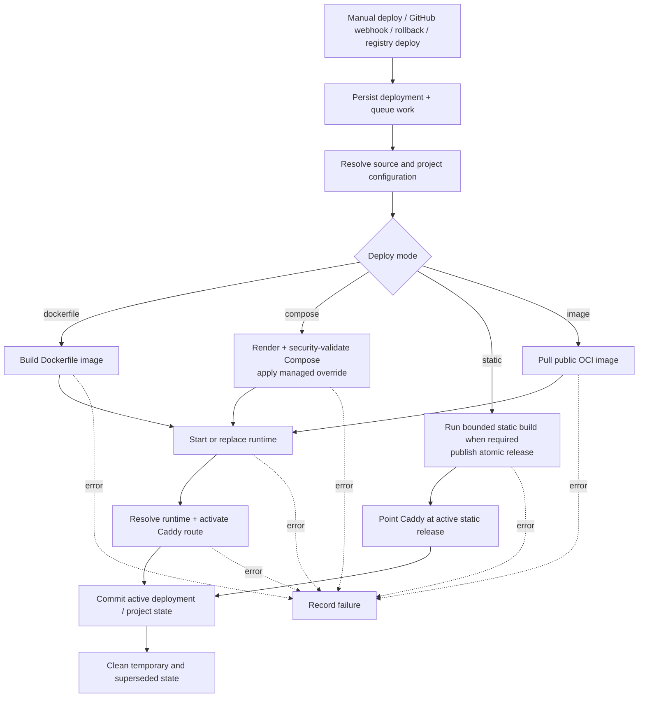
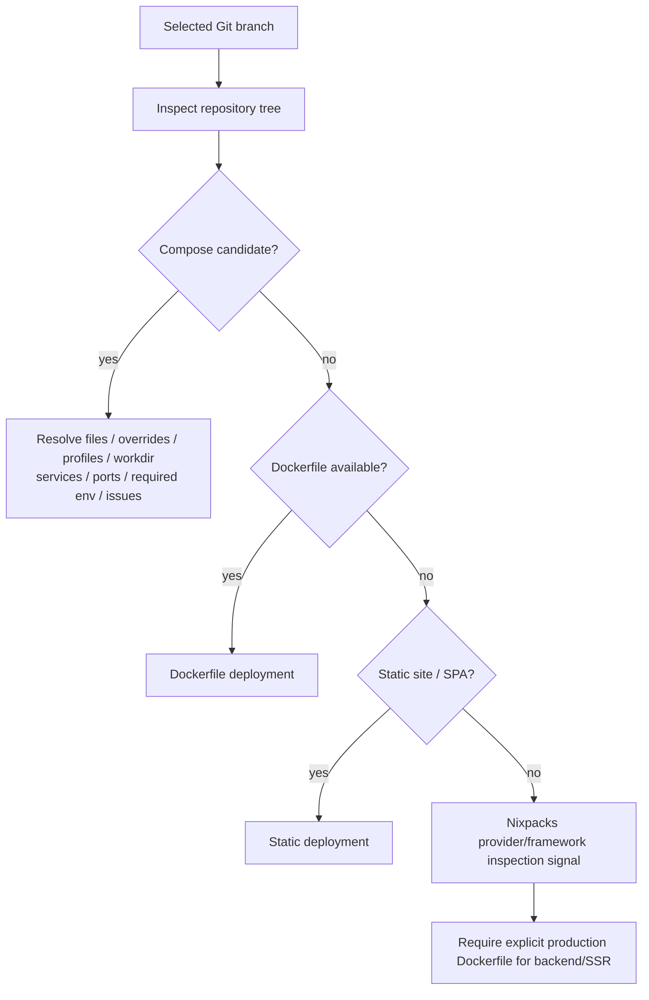
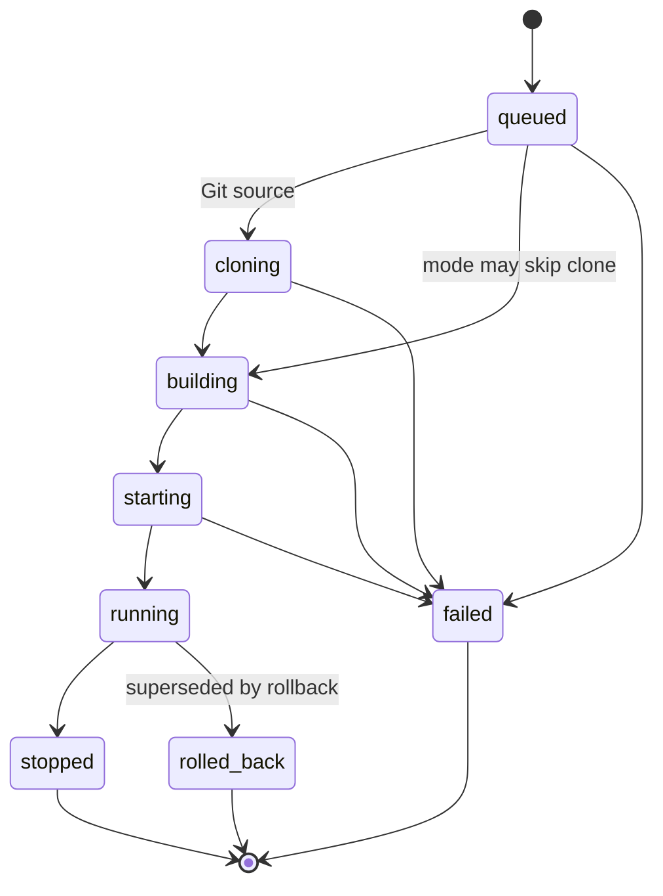
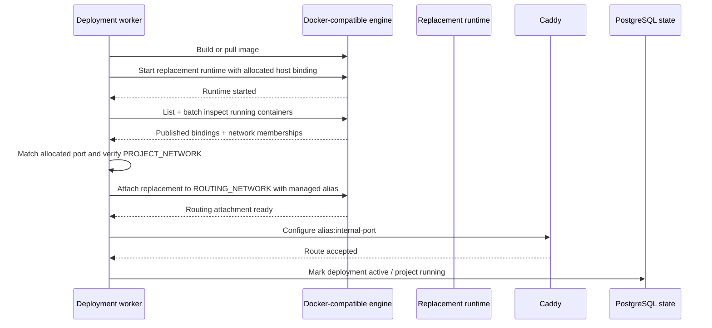
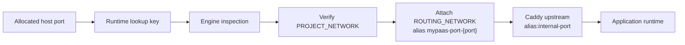
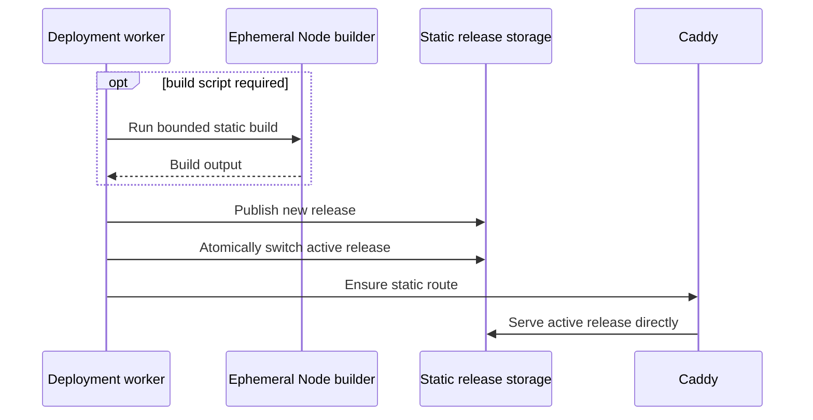

# Deployment Architecture

> Source inspection, deployment execution, lifecycle state, and public route activation.

**Status:** Current  
**Applies to:** `main`  
**Last verified:** 2026-08-13  
**Verified against commit:** `f76102997089a3f1a3b5e7d9f4326582ff22e02c`

---

## Supported deployment modes

| Source | Deploy mode | Execution model | Historical rollback |
| --- | --- | --- | --- |
| Git | `dockerfile` | Build repository Dockerfile, start managed runtime, activate route | Yes |
| Git | `compose` | Render/validate Compose, apply MyPaaS override, start services, route selected service | Yes |
| Git | `static` | Build when needed, publish static release, serve directly with Caddy | Redeploy/roll-forward |
| Registry | `image` | Pull public OCI image, start managed runtime, activate route | Yes |

Nixpacks is an inspection signal, not a deployment mode. A backend/SSR repository without Compose or a production Dockerfile is not silently turned into an opaque generated runtime.

## Common pipeline

The worker model is intentionally bounded rather than an external distributed scheduler. The current platform remains single-host.

## Repository inspection

Project creation and deployment configuration inspect the selected Git source instead of inferring a runtime from marketing-style framework detection.

Compose is treated as untrusted configuration. The final rendered model is evaluated before execution, and MyPaaS strips repository-defined host ports and container names before applying its managed runtime override.

## Compose execution boundary

The current policy rejects configuration that could bypass the intended host boundary, including:

- privileged containers;
- host/container namespace sharing;
- Docker/Podman socket mounts;
- host bind mounts;
- devices and GPUs;
- added Linux capabilities;
- custom runtimes;
- external networks and external volumes;
- unsafe build entitlements;
- build SSH and build secrets;
- privileged lifecycle hooks.

Safe engine-managed named volumes are allowed by Compose sanitization. Project environment values are passed through generated project env files. Compose subprocesses receive a fail-closed host-environment allowlist rather than inheriting arbitrary API process credentials.

## Deployment status model

The current API/frontend contract exposes these deployment status values:

The diagram shows a typical progression while documenting the public status vocabulary: `queued`, `cloning`, `building`, `starting`, `running`, `failed`, `stopped`, and `rolled_back`. Individual deployment modes can skip stages that do not apply.

A rollback action is an explicit deployment trigger; the deployment being superseded can be recorded as `rolled_back` while the rollback operation proceeds through its own deployment path.

Project state is a separate model with `pending`, `building`, `running`, `stopped`, and `crashed` states.

## Runtime replacement and route activation

Dockerfile and image deployments can replace a runtime while keeping routing identity independent of a stable container name.

The important property is ordering: route resolution identifies the replacement by its allocated host binding, not by an assumed final container name.

## Production routing path

Route resolution is fail-closed. MyPaaS does not silently proxy to an arbitrary host IP when the expected runtime cannot be validated.

## Static release path

Static projects bypass the container runtime after any required build step.

The static Node builder has a simple safety ceiling of 2 GiB RAM, 2 CPUs, and 512 PIDs. The deployment context supplies the outer build timeout.

## Rollback semantics

Dockerfile, Compose, and registry-image deployments keep historical deployment state that can be used for rollback. Static projects recover through a target-revision redeploy/roll-forward model rather than pretending that a removed container runtime exists.

A rollback is itself an explicit deployment action and should remain visible in deployment history/audit behavior.

## Failure handling principles

- persist deployment state before asynchronous work begins;
- reject unsafe Compose input before engine execution;
- do not mark a deployment active before its required runtime/static route is ready;
- fail closed when runtime route identity cannot be resolved;
- preserve explicit failure status and build/error information;
- keep cleanup separate from the correctness of activating the new deployment.

## Related documents

- [Architecture overview](overview.md)
- [Networking and trust boundaries](networking.md)
- [Observability architecture](observability.md)
- [Security boundaries](../SECURITY_BOUNDARIES.md)
