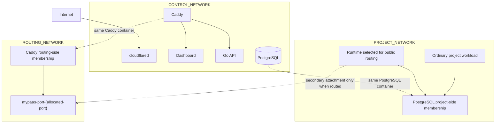
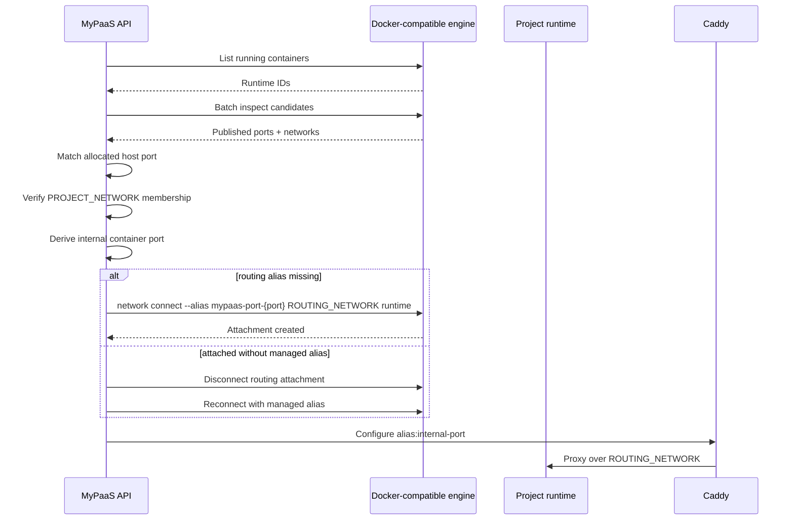
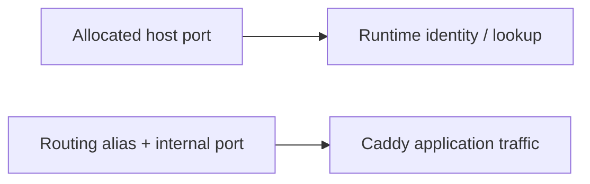
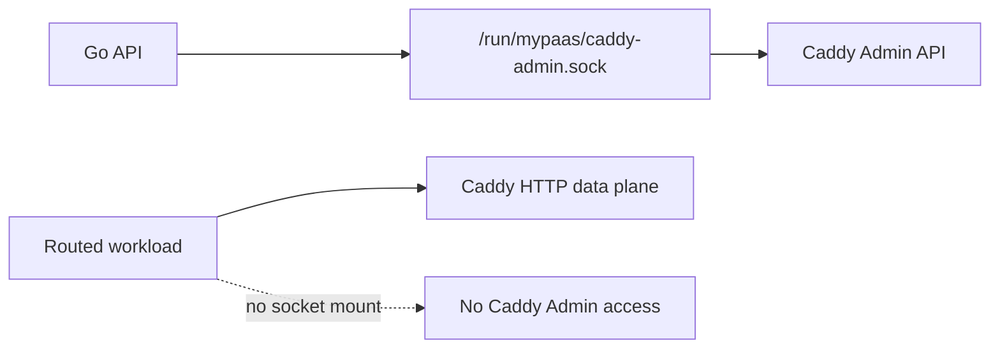
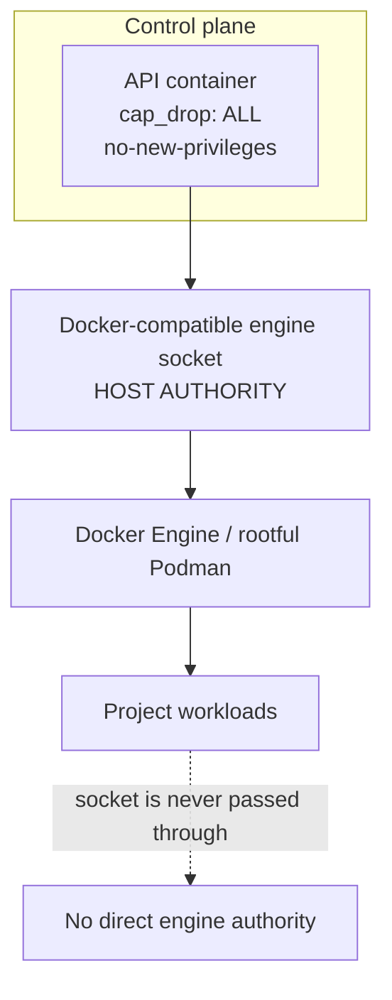

# Networking and Trust Boundaries

> Production network membership, route activation, and privileged control paths.

**Status:** Current  
**Applies to:** `main`  
**Last verified:** 2026-08-13  
**Verified against commit:** `f76102997089a3f1a3b5e7d9f4326582ff22e02c`

---

## Network membership

Production creates three distinct external networks.

| Component | `CONTROL_NETWORK` | `PROJECT_NETWORK` | `ROUTING_NETWORK` |
| --- | :---: | :---: | :---: |
| API | ✓ | — | — |
| Dashboard | ✓ | — | — |
| cloudflared | ✓ | — | — |
| PostgreSQL | ✓ | ✓ | — |
| Caddy | ✓ | — | ✓ |
| Normal project workload | — | ✓ | — |
| Publicly routed runtime | — | ✓ | ✓ |

The default names are `mypaas-control`, `mypaas-projects`, and `mypaas-routing`. Production validation requires all three names to be distinct.

## Topology



The duplicated labels in the diagram represent network interfaces on the same logical containers; they are not duplicate services.

## Why three networks

### Control network

The control network carries platform communication. Project workloads are not attached to it, so a normal workload does not automatically receive container-network adjacency to the API, dashboard, cloudflared, or Caddy's control-side membership.

### Project network

The project network is the default workload network. It permits project-to-project-service communication and optional shared PostgreSQL access. Caddy is intentionally not a general member of this network.

### Routing network

The routing network is a narrow application data plane. Caddy joins it permanently; a project runtime joins it only when MyPaaS activates that runtime's public route.

This avoids making every project workload directly adjacent to Caddy while still giving Caddy a stable container-network path to the intended public runtime.

## Dynamic route activation

Allocated host ports remain deterministic runtime identity keys. Production Caddy does not use them as the normal application traffic path.



The managed alias is:

```text
mypaas-port-<allocated-port>
```

The implementation fails closed if it cannot identify a running container that owns the expected published host port, verify project-network membership, derive the internal port, or establish the managed routing alias.

## Why the host port is still present

The published host binding remains useful for runtime identity and existing lifecycle/accounting semantics. It lets MyPaaS locate the correct runtime without depending on container-name stability or compatibility-layer IP fields.

The important distinction is:



This is especially important during Dockerfile/image replacement deployments, where a temporary replacement container can be selected and routed before it receives a stable project container name.

## Caddy control plane

Caddy's production Admin API is not exposed on TCP port `2019`.



The API and Caddy share `/run/mypaas`; project workloads do not receive that host mount.

## Engine authority boundary

The strongest trust boundary in the current architecture is the Docker-compatible engine socket.



Container hardening on the API reduces ambient Linux privilege but does not neutralize engine authority. An API compromise must therefore be treated as a host-boundary compromise.

## PostgreSQL dual-homing

PostgreSQL intentionally joins both control and project networks because optional shared PostgreSQL provisioning is a platform feature. This is not an accidental topology leak.

That tradeoff means network segmentation should not be described as absolute tenant isolation. Database isolation also depends on generated database/user credentials and PostgreSQL authorization.

## Security invariants

Current production assumptions are:

- the three network names are distinct;
- API, dashboard, and cloudflared are not project-network members;
- API is not a routing-network member;
- Caddy is not a general project-network member;
- only explicitly routed runtimes gain routing-network membership;
- project workloads never receive the engine socket;
- project workloads never receive the Caddy Admin Unix socket;
- route resolution fails closed instead of proxying to an arbitrary fallback address.

These invariants reduce unintended adjacency. They do not replace VM/microVM isolation for mutually hostile tenants.

## Related documents

- [Architecture overview](overview.md)
- [Deployment architecture](deployment.md)
- [Security boundaries](../SECURITY_BOUNDARIES.md)
