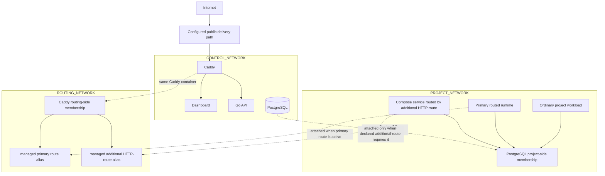
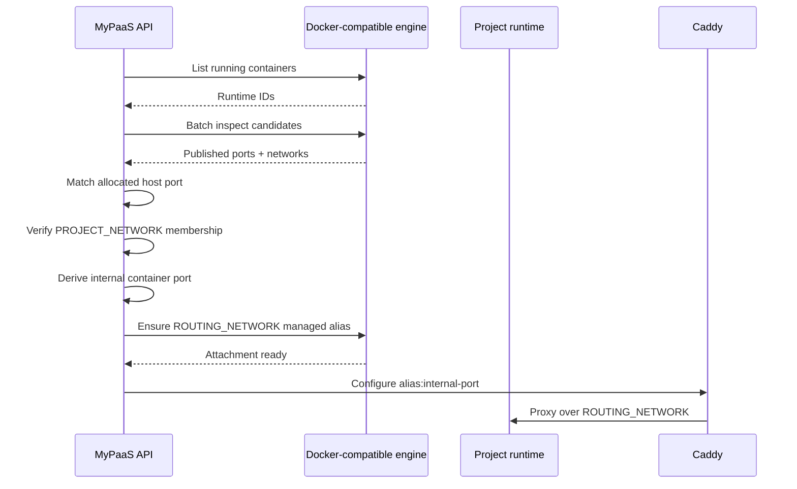
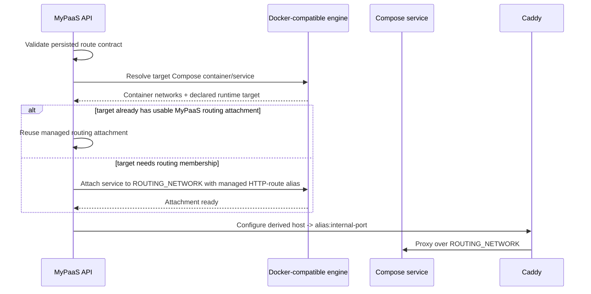
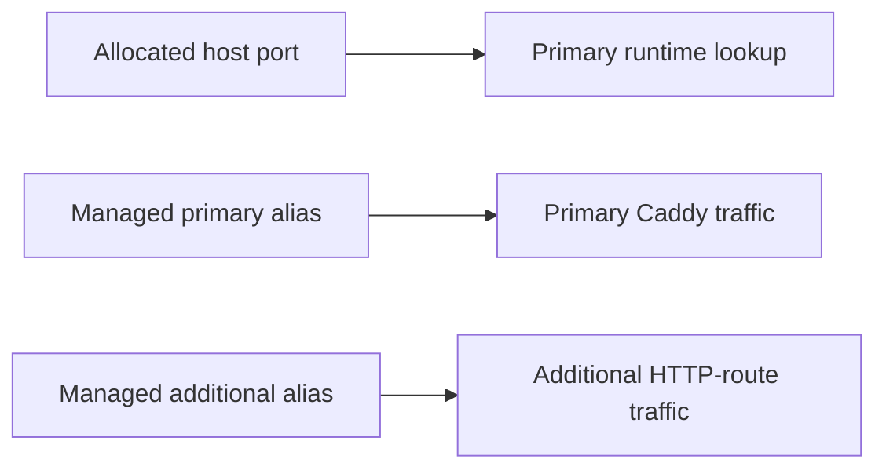
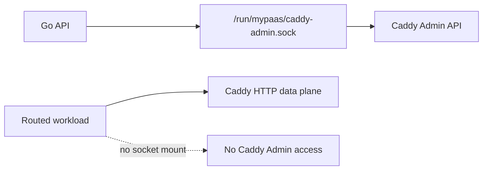
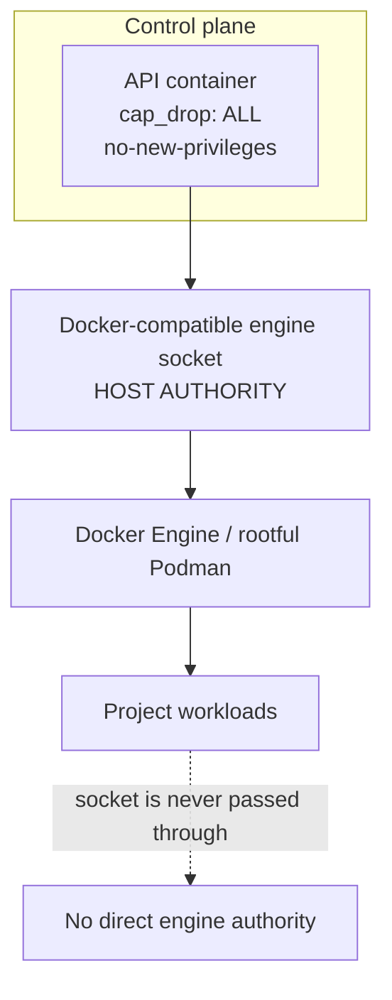

# Networking and Trust Boundaries

> Production network membership, route activation, and privileged control paths.

**Status:** Current  
**Applies to:** `main`  
**Last verified:** 2026-08-28  
**Verified against commit:** `e12f47dd3249e2fdd69df352852ff3c9c3489245`

---

## Network membership

Production creates three distinct external networks.

| Component | `CONTROL_NETWORK` | `PROJECT_NETWORK` | `ROUTING_NETWORK` |
| --- | :---: | :---: | :---: |
| API | ✓ | — | — |
| Dashboard | ✓ | — | — |
| cloudflared | ✓ | — | — |
| PostgreSQL | ✓ | ✓ | — |
| Caddy | ✓ | — | ✓ |
| Normal project workload | — | ✓ | — |
| Publicly routed runtime/service | — | ✓ | ✓ |

The default names are `mypaas-control`, `mypaas-projects`, and `mypaas-routing`. Production validation requires all three names to be distinct.

## Topology

The duplicated labels represent network interfaces on the same logical containers; they are not duplicate services.

## Why three networks

### Control network

The control network carries platform communication. Project workloads are not attached to it, so a normal workload does not automatically receive container-network adjacency to the API, dashboard, cloudflared, or Caddy's control-side membership.

### Project network

The project network is the default workload network. It permits project-service communication and optional shared PostgreSQL access. Caddy is intentionally not a general member of this network.

### Routing network

The routing network is the bounded application data plane. Caddy joins it permanently; a project runtime/service joins it only when MyPaaS activates a public route that needs that target.

This keeps general project workloads away from Caddy while still allowing explicit primary and additional HTTP routes to reach their intended service over container networking.

## Primary route activation

Allocated host ports remain deterministic runtime identity keys for normal primary container-backed routes. They are not the normal production traffic path.

The primary managed alias remains based on the allocated project port. Route resolution fails closed if MyPaaS cannot identify the intended running container, verify project-network membership, derive the internal port, or establish the managed routing attachment.

## Additional Compose HTTP routes

Compose projects may declare up to four additional HTTP routes. Each route uses a derived hostname and targets an existing Compose service plus an explicitly declared internal TCP port.

Additional-route rules:

- the public hostname is `<project>-<route>.<PUBLIC_DOMAIN>`;
- the target service/port must exist in the resolved Compose contract;
- no extra host port is allocated or published;
- the route is HTTP(S)-only through Caddy;
- no raw TCP, SSH, UDP, or arbitrary-domain forwarding is implied;
- stop/delete remove public routes;
- reconciliation recreates missing routes for eligible running projects.

When multiple HTTP surfaces live on the same container, such as MinIO `9000` and `9001`, MyPaaS can reuse the same routing-network attachment while Caddy targets different internal ports.

When an additional route targets another eligible Compose service, only that service receives the routing-network attachment required for the route.

## Why the primary host port still exists

The published host binding remains useful for primary runtime identity and existing lifecycle/accounting semantics.

Additional Compose HTTP routes do not create another host-port identity. Their target is resolved from the persisted Compose route contract and container/service state.

## Caddy control plane

Caddy's production Admin API is not exposed on TCP port `2019`.

The API and Caddy share `/run/mypaas`; project workloads do not receive that host mount.

## Engine authority boundary

The strongest trust boundary in the current architecture is the Docker-compatible engine socket.

Production maps the selected host engine socket into the API at the stable in-container path `/var/run/docker.sock`. Container hardening reduces ambient Linux privilege but does not neutralize engine authority.

## PostgreSQL dual-homing

PostgreSQL intentionally joins both control and project networks because optional shared PostgreSQL provisioning is a platform feature. This is not an accidental topology leak.

That tradeoff means network segmentation should not be described as absolute tenant isolation. Database isolation also depends on generated database/user credentials and PostgreSQL authorization.

## Security invariants

Current production assumptions are:

- the three network names are distinct;
- API, dashboard, and cloudflared are not project-network members;
- API is not a routing-network member;
- Caddy is not a general project-network member;
- only explicitly routed runtimes/services gain routing-network membership;
- additional Compose routes do not publish extra host ports;
- project workloads never receive the engine socket;
- project workloads never receive the Caddy Admin Unix socket;
- route resolution fails closed instead of proxying to an arbitrary fallback address.

These invariants reduce unintended adjacency. They do not replace VM/microVM isolation for mutually hostile tenants.

## Related documents

- [Architecture overview](overview.md)
- [Deployment architecture](deployment.md)
- [Security boundaries](../SECURITY_BOUNDARIES.md)
- [ADR-023: bounded additional Compose HTTP routes](../adr/ADR-023-compose-additional-http-routes.md)
