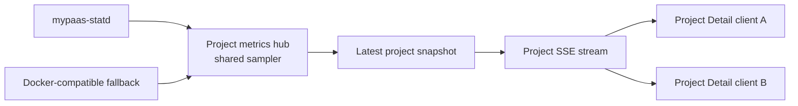
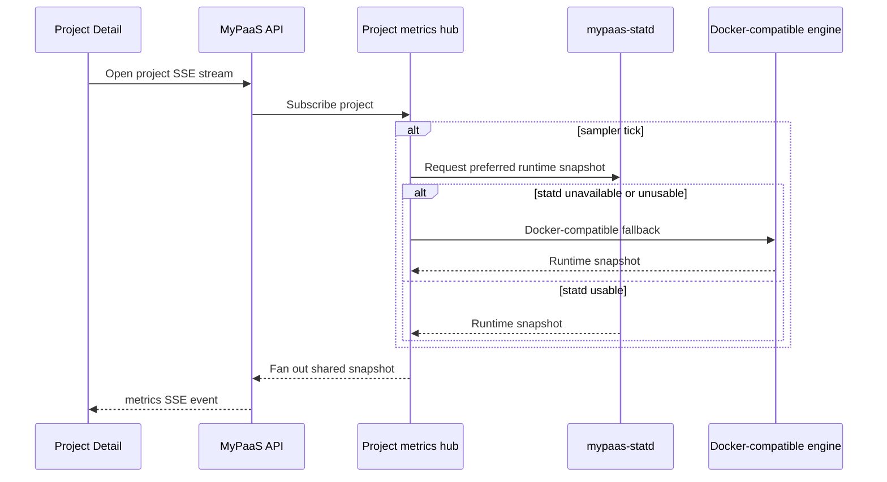
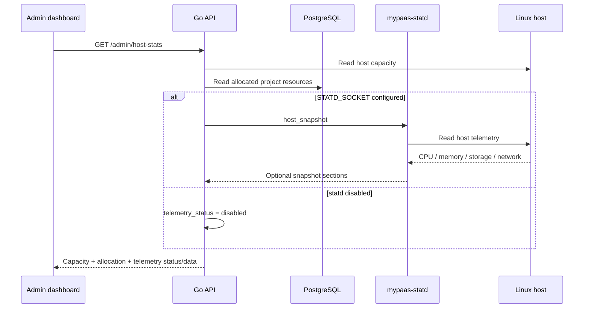
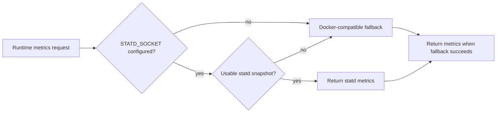
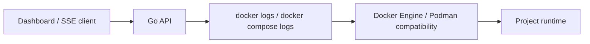
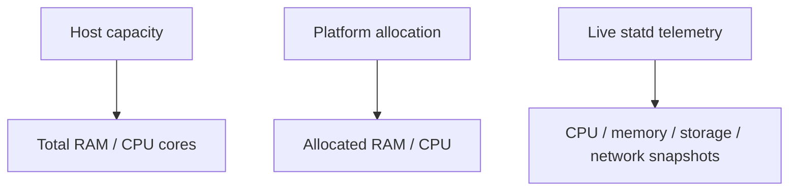

# Observability Architecture

> Runtime metrics, host telemetry, logs, health signals, and fallback behavior.

**Status:** Current  
**Applies to:** `main`  
**Last verified:** 2026-08-28  
**Verified against commit:** `e12f47dd3249e2fdd69df352852ff3c9c3489245`

---

## Observability surfaces

MyPaaS currently has four distinct observability paths:

| Surface | Primary path | Fallback / note |
| --- | --- | --- |
| Runtime CPU/memory/PID metrics | `mypaas-statd` over Unix socket | Docker-compatible metrics fallback |
| Host CPU/memory/storage/network telemetry | statd host snapshot | No container-namespace fallback; capacity/allocation still returned |
| Project logs | Docker-compatible CLI | No native log daemon in current architecture |
| Control-plane health/metrics | `/health`, `/ready`, `/metrics` | `/metrics` requires configured Basic Auth in production |

Optional Cloudflare analytics can add request, bandwidth, error, and timeseries data for routed traffic. Edge analytics are separate from host/runtime resource telemetry and should not be treated as a universal application-capacity measurement.

## Runtime metrics path

Project runtime telemetry uses a shared per-project sampler/fan-out path. Browser clients do not independently trigger engine/statd sampling loops.





Static projects have no application runtime and do not start runtime container telemetry sampling.

Cloudflare traffic analytics are intentionally separate from runtime SSE and use a slower application-level refresh path.

## Host telemetry path

The API's owner-only host-stats endpoint keeps configured host capacity/allocation independent from optional telemetry.



Current response categories include host RAM/CPU capacity, allocated project resources, telemetry status/error state, and optional memory/CPU/storage/network snapshots.

Host telemetry failure does not make the endpoint discard configured capacity/allocation values. MyPaaS intentionally does **not** derive host filesystem or network telemetry from inside the API container because its namespaces do not represent the host contract.

## statd availability and fallback



Fallback is non-fatal but observable. The API exposes low-cardinality Prometheus signals for statd availability, fallbacks, snapshot errors, and registration errors.

Logging is transition-aware so a persistent statd outage does not generate a warning on every SSE tick.

## Project log path

Project log collection remains intentionally simple.



Compose logging discovers services and reads recent logs per service. Live project events are delivered through SSE.

A native log collector is not a target feature without a concrete user-visible correctness or operability problem in the current path.

## Control-plane health

The API exposes:

```text
/health
/ready
/metrics
```

- `/health` is a lightweight liveness surface.
- `/ready` is the readiness surface used by production verification.
- `/metrics` is Prometheus-compatible and uses Basic Auth in production when metrics are enabled/configured.

Production verification also checks configured statd availability, the Caddy Admin Unix socket, and control-plane topology.

## Host capacity versus telemetry

Capacity and telemetry answer different questions:



Capacity/allocation remain useful even when optional host telemetry is disabled or temporarily unavailable. The dashboard should not conflate telemetry loss with zero host capacity.

## Failure semantics

- Runtime statd failure falls back to Docker-compatible metrics when possible.
- Host telemetry failure is fail-open for capacity/allocation but exposes diagnostic status/error state.
- Host storage/network data is not fabricated from the API container namespace.
- Static projects skip runtime telemetry by design.
- Project logs remain on the CLI path until a concrete product defect justifies another collection architecture.
- Observability data must not be turned into a generic RPS, concurrent-user, or hardware-capacity promise.

## Engineering measurements

Low-level implementation measurements may exist in engineering repositories or historical evidence to justify a concrete internal change. They are not part of the current MyPaaS product contract and are intentionally not reproduced here as product claims.

## Related documents

- [Architecture overview](overview.md)
- [Deployment architecture](deployment.md)
- [mypaas-statd integration](../STATD.md)
- [Security boundaries](../SECURITY_BOUNDARIES.md)
