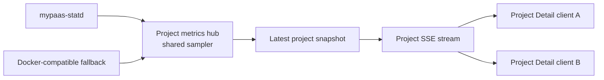
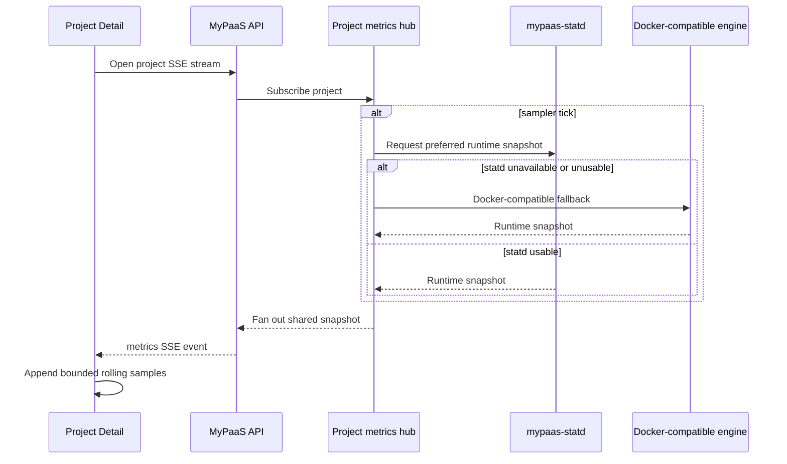
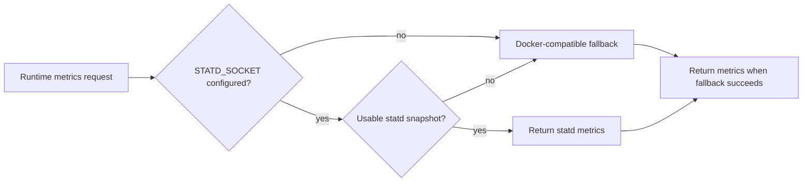
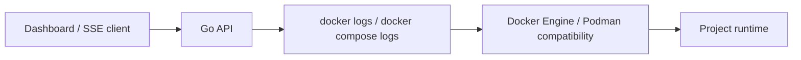
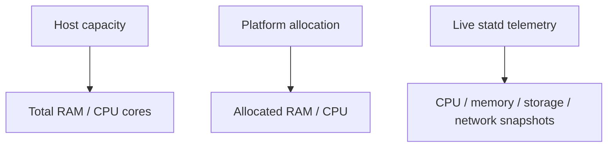

# Observability Architecture

> Runtime metrics, host telemetry, logs, health signals, and fallback behavior.

**Status:** Current  
**Applies to:** `main`  
**Last verified:** 2026-08-13  
**Verified against commit:** `8769f0bb5373e8ec8ca584d6e2cbbf6fb5820cbf`

---

## Observability surfaces

MyPaaS currently has four distinct observability paths:

| Surface | Primary path | Fallback / note |
| --- | --- | --- |
| Runtime CPU/memory/PID metrics | `mypaas-statd` over Unix socket | Docker-compatible metrics fallback |
| Host CPU/memory/storage/network telemetry | statd v0.2 `host_snapshot` | No container-namespace fallback; capacity/allocation still returned |
| Project logs | Docker-compatible CLI | No native log daemon in current architecture |
| Control-plane health/metrics | `/health`, `/ready`, `/metrics` | `/metrics` requires configured Basic Auth in production |

Optional Cloudflare analytics add request, bandwidth, error, and timeseries data for routed traffic; they are separate from host/runtime resource telemetry.

## Runtime metrics path

Project runtime telemetry uses a shared per-project sampler/fan-out path. Browser clients do not independently trigger Docker/statd sampling loops.





The API keeps bounded runtime identity metadata for statd and a shared project metrics hub for fan-out. A second browser viewing the same project subscribes to the same project sampler instead of creating another runtime sampling loop. Static projects have no application runtime and do not start runtime telemetry sampling.

Cloudflare traffic analytics are intentionally separate from runtime SSE. Project Detail fetches edge analytics through the analytics REST path on a slow refresh cadence; 24-hour request/bandwidth/error aggregates are not queried on every runtime metrics tick.

## Host telemetry path

The production installer currently defaults to `mypaas-statd` **v0.2.0**. The API's owner-only host-stats endpoint keeps host capacity/allocation independent from optional telemetry.


Current response categories include:

- `host_ram_bytes`;
- `host_cpu_cores`;
- `allocated_ram_mb`;
- `allocated_cpu`;
- `telemetry_status`;
- optional `telemetry_error_code`;
- optional `memory`;
- optional `cpu`;
- optional `storage`;
- optional `network`.

`telemetry_status` is `disabled`, `unavailable`, or `available`. Host telemetry failure does not make the endpoint discard the capacity/allocation values.

MyPaaS intentionally does **not** derive host storage/network telemetry from inside the API container as a fallback. The API container's own mount and network namespaces are not equivalent to the host contract.

## statd availability and fallback



Fallback is non-fatal but observable. The API exposes low-cardinality Prometheus metrics:

```text
mypaas_statd_available
mypaas_statd_fallback_total
mypaas_statd_snapshot_errors_total
mypaas_statd_registration_errors_total
```

Logging is transition-aware so a persistent statd outage does not generate a warning on every SSE metrics tick.

## Historical runtime benchmark evidence

The accepted Phase 4 real-host evidence is preserved in the `nabilrn/mypaas-statd` repository at:

```text
benchmarks/results/phase4-debian13-podman-2026-08-10/
```

That benchmark tested statd commit:

```text
cf8843545ea19ecf9a54049e21b2fe609e49d58d
```

Environment:

- Debian GNU/Linux 13;
- kernel `6.12.88+deb13-amd64`;
- rootful Podman 5.4.2;
- Docker-compatible socket path backed by Podman;
- 50 warmup samples;
- 500 recorded iterations per trial;
- three trials.

Across those recorded runs, `docker stats --no-stream` had p50 latency around **41–43 ms** and p95 around **52–56 ms**. statd protocol v1 had p50 around **0.78–0.82 ms** and p95 around **0.88–1.09 ms**. The CLI baseline spawned 500 child processes per recorded trial; the statd path spawned none.

Those numbers are **historical benchmark evidence for the runtime snapshot path**, not a generic promise for all hosts or a fresh v0.2 host-telemetry benchmark. Raw JSON in the statd repository remains the source of truth.

## Project log path

Project log collection remains intentionally simpler than metrics.



Compose logging discovers services and reads recent logs per service. Live project events are delivered through SSE.

`benchmarks/log_path.py` mirrors the current Compose log-command path and records latency, subprocess count, and child CPU. A persistent/native log collector should only be introduced if measurements show a concrete bottleneck that justifies another daemon and protocol.

## Control-plane health

The API exposes:

```text
/health
/ready
/metrics
```

- `/health` is a lightweight liveness surface.
- `/ready` is the readiness surface used by production verification.
- `/metrics` is Prometheus-compatible and uses Basic Auth in production when metrics are enabled/configured.

Production verification also checks the configured statd service/socket and Caddy Admin Unix socket, in addition to control-plane topology.

## Host capacity versus telemetry

Capacity and telemetry answer different questions:



Capacity/allocation remain useful even if statd host telemetry is disabled or temporarily unavailable. The dashboard should not conflate a telemetry outage with the host having zero capacity.

## Failure semantics

- Runtime statd failure falls back to Docker-compatible metrics when possible.
- Host telemetry failure is fail-open for capacity/allocation but exposes diagnostic status/error code.
- Host storage/network data is not fabricated from the API container namespace.
- Static projects skip runtime telemetry by design.
- Benchmark claims must remain tied to recorded evidence.
- Logging remains on the CLI path until measured evidence justifies a native collector.

## Related documents

- [Architecture overview](overview.md)
- [Deployment architecture](deployment.md)
- [mypaas-statd integration](../STATD.md)
- [Security boundaries](../SECURITY_BOUNDARIES.md)
