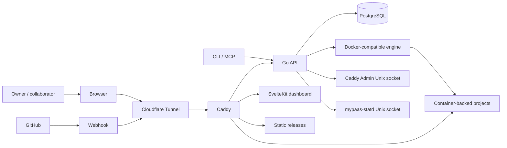
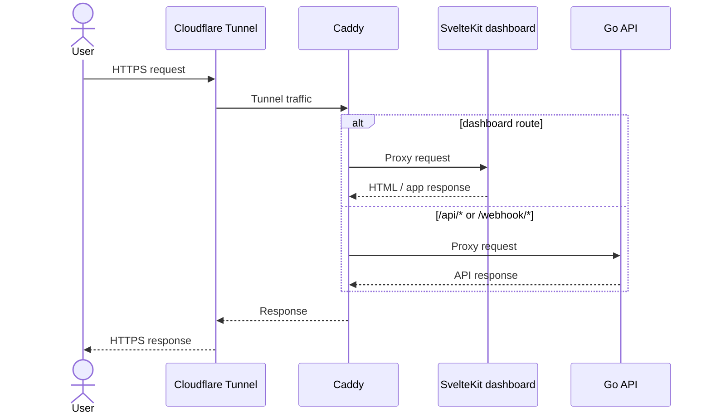
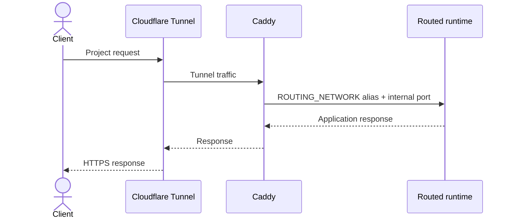
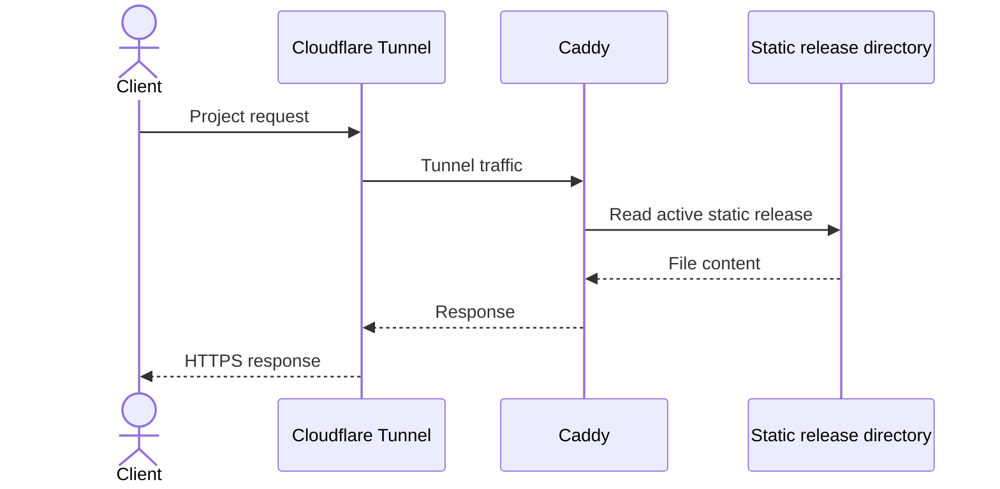
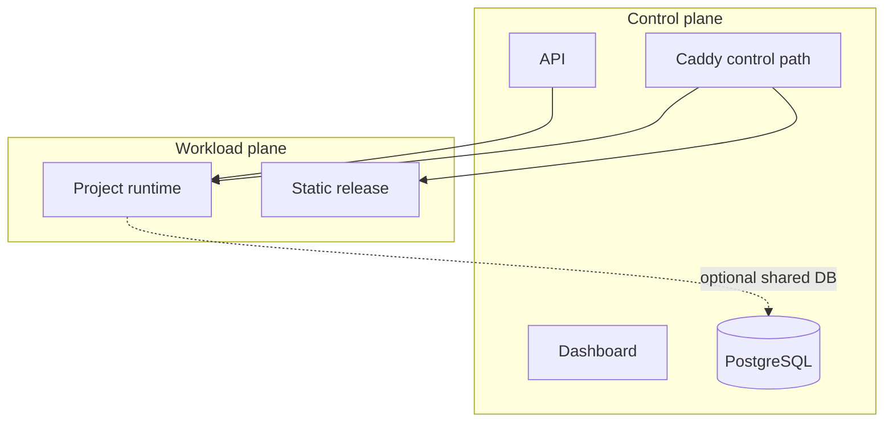
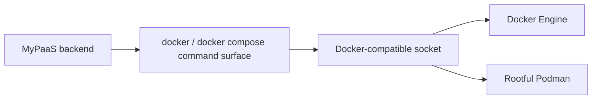

# Architecture Overview

> System context and major responsibilities for the current MyPaaS control plane.

**Status:** Current  
**Applies to:** `main`  
**Last verified:** 2026-08-13  
**Verified against commit:** `8769f0bb5373e8ec8ca584d6e2cbbf6fb5820cbf`

---

## System context

The public path terminates at Cloudflare and reaches Caddy through the tunnel. Caddy is the front door for the dashboard, `/api/*`, `/webhook/*`, static projects, and dynamically managed project routes.

## Control-plane responsibilities

### Go API

The API is the orchestration authority. Its responsibilities include:

- GitHub OAuth and authorization;
- project configuration and deployment state;
- repository inspection;
- Dockerfile, Compose, static, and public registry-image deployments;
- lifecycle actions and rollback;
- environment-variable encryption and management;
- resource quotas and settings;
- Caddy route reconciliation;
- backups and VM migration;
- DB Studio and optional shared PostgreSQL provisioning;
- CLI/MCP endpoints;
- runtime metrics integration and host telemetry.

Because orchestration requires the Docker-compatible engine socket, compromise of the API must be treated as compromise of the host boundary.

### Dashboard

The SvelteKit dashboard is an operator UI over the API. It does not directly orchestrate the engine, configure Caddy, or read host cgroups.

### PostgreSQL

PostgreSQL stores control-plane state. It is also optionally used to provision project-specific shared databases and users. That feature is why PostgreSQL intentionally participates in both control and project networks.

### Caddy

Caddy has two distinct roles:

1. stable ingress for dashboard/API/webhook traffic;
2. data-plane routing and static-file serving for projects.

Its production Admin API is reachable only over `/run/mypaas/caddy-admin.sock`, shared with the API container through `/run/mypaas`.

### cloudflared

`cloudflared` is an outbound tunnel client. It joins the control network and sends incoming tunnel traffic to Caddy.

### mypaas-statd

`mypaas-statd` is a host-native systemd daemon. It reads host cgroup v2 data and exposes bounded snapshots over `/run/mypaas/statd.sock`. It is not a privileged sidecar container and does not expand the API container with host `/proc` or cgroup mounts.

## Request paths

### Dashboard and API

### Container-backed project

Caddy does not normally hairpin project traffic through the allocated host port in production. The allocated host port is used to locate the intended runtime; the data plane uses a managed routing-network alias.

### Static project

Static projects have no persistent application container and therefore do not use runtime statd metrics.

## Control plane versus workload plane

The separation is deliberate but not absolute multi-tenant isolation. The API is privileged through engine authority, and shared PostgreSQL is intentionally reachable from workloads when that platform feature is used.

## Engine portability

MyPaaS does not branch its orchestration logic into Docker-specific and Podman-specific implementations. The supported portability model is:

This keeps the runtime abstraction small and makes compatibility behavior testable through one command contract.

## Scope

The current architecture intentionally does not provide:

- Kubernetes scheduling;
- multi-node placement or HA control-plane failover;
- automatic horizontal autoscaling;
- private-registry credential management;
- VM/microVM isolation between arbitrary hostile tenants;
- a second native Podman orchestration backend.

Those are product/architecture changes, not hidden assumptions of the current implementation.

## Related documents

- [Networking and trust boundaries](networking.md)
- [Deployment architecture](deployment.md)
- [Observability architecture](observability.md)
- [Security boundaries](../SECURITY_BOUNDARIES.md)
- [mypaas-statd integration](../STATD.md)
