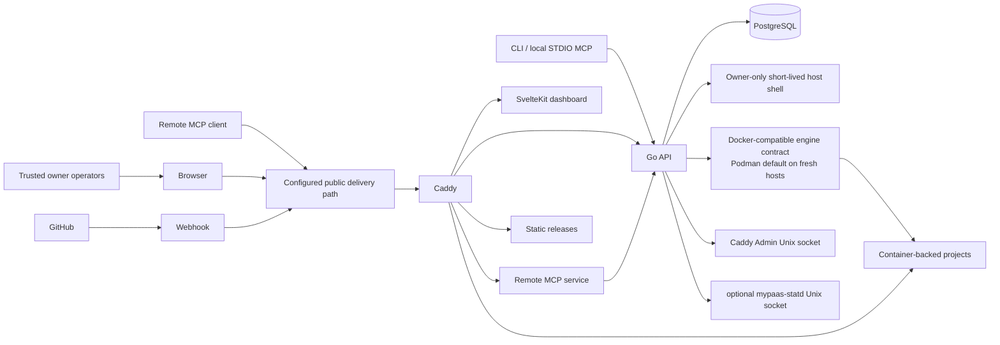
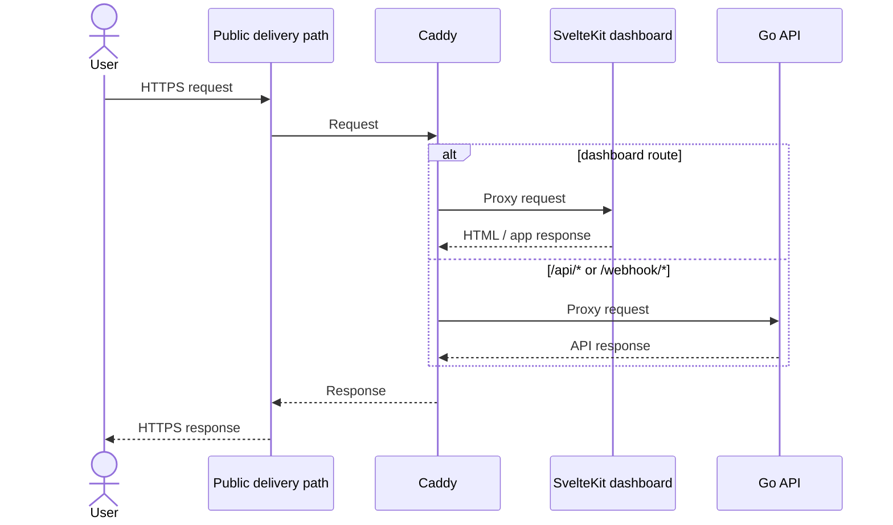
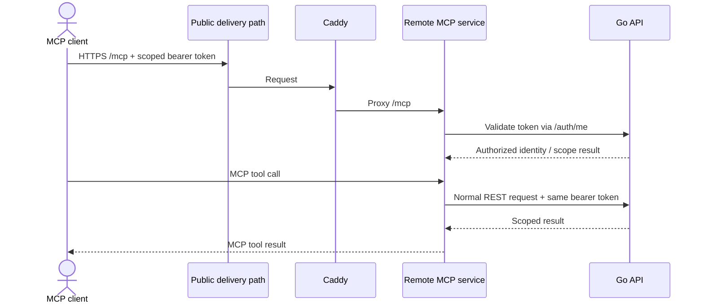
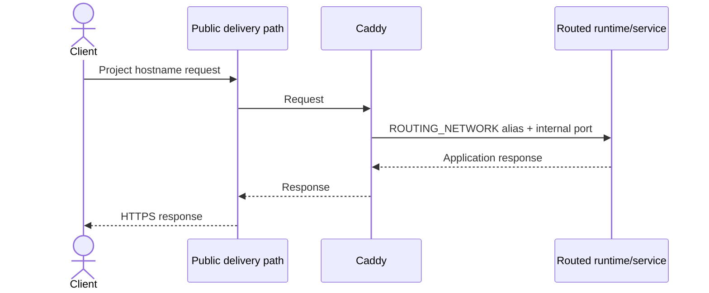
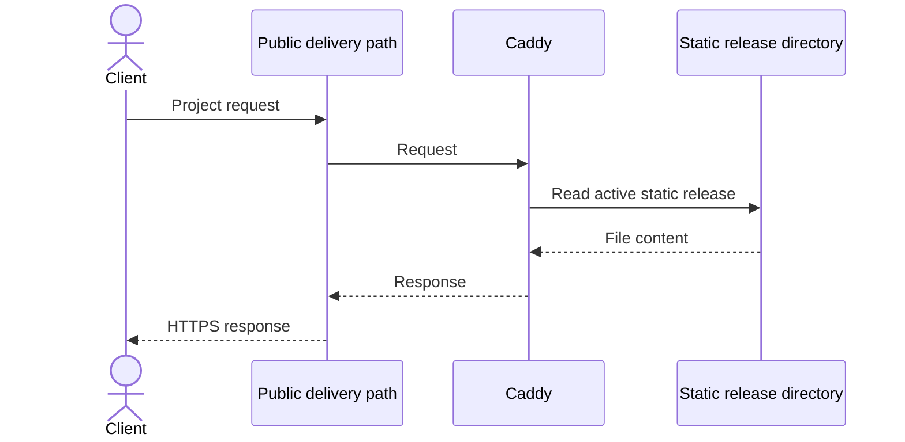
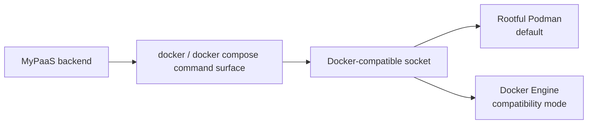

# Architecture Overview

> System context and major responsibilities for the current MyPaaS control plane.

**Status:** Current  
**Applies to:** `main`  
**Last verified:** 2026-09-07  
**Verified against commit:** `975532ac46ae4c06aee3c30c11464cc057b7a8bc`

---

## System context

Caddy is the front door for dashboard/API/webhook traffic, the remote MCP endpoint, static projects, primary project routes, and bounded additional Compose HTTP routes.

## Control-plane responsibilities

### Go API

The API is the orchestration authority. Its responsibilities include:

- GitHub OAuth and authorization;
- project configuration and deployment state;
- repository inspection;
- Dockerfile, Compose, static, and OCI image deployments;
- bounded private-registry authentication for image-mode pulls;
- lifecycle actions and rollback;
- encrypted environment-variable management;
- resource quotas and settings;
- primary and additional Caddy route reconciliation;
- project-scoped persistent-storage management;
- backups and VM migration;
- DB Studio and optional shared PostgreSQL provisioning;
- REST endpoints consumed by the CLI and MCP integrations;
- scoped machine-token authentication and authorization;
- runtime metrics integration and host telemetry.

Because orchestration requires the Docker-compatible engine socket, compromise of the API must be treated as compromise of the host boundary.

### Remote MCP service

The remote MCP process is a stateless Streamable HTTP adapter on the control network. Caddy exposes it at `/mcp`; the service itself has no Docker-compatible engine socket, Caddy Admin socket, PostgreSQL connection, or project-network membership.

Remote MCP authenticates `myp_*` bearer credentials through the Go API before MCP initialization. Each tool call then calls the normal REST API with the same scoped bearer token, so REST authorization remains the single enforcement boundary. Machine-token routes are explicitly allowlisted and new routes fail closed until mapped.

Scoped keys are stored hash-only and may expire or be revoked. Remote tools intentionally exclude the host shell, DB Studio, environment-value reveal, raw SQL, project deletion, route mutation, webhook-secret operations, backup/update, and other owner-only host authority. MCP calls include bounded audit metadata such as token identity and tool name without logging the bearer secret or environment values.

The existing local STDIO bridge remains available for compatible clients and continues to call the Go API rather than orchestrating the engine directly.

### Dashboard

The SvelteKit dashboard is an operator UI over the API. It does not directly orchestrate the engine, configure Caddy, or read host cgroups.

### PostgreSQL

PostgreSQL stores control-plane state. It is also optionally used to provision project-specific shared databases and users, so it intentionally participates in both control and project networks.

### Caddy

Caddy has two distinct roles:

1. stable ingress for dashboard/API/webhook/remote-MCP traffic;
2. data-plane routing and static-file serving for projects.

Project routing includes the primary project hostname and, for eligible Compose projects, up to four additional platform-derived HTTP hostnames. Additional routes never grant access to the Caddy Admin socket.

Whitelisted users are trusted owners. The first account is the non-removable master account. Owners can use the owner-only Shell page to open a short-lived host shell; this is separate from public project routing and does not expose generic SSH/TCP forwarding.

The production Admin API is reachable only over `/run/mypaas/caddy-admin.sock`, shared with the API container through `/run/mypaas`.

### cloudflared

`cloudflared` is the default production outbound tunnel client. It joins the control network and sends incoming tunnel traffic to Caddy. The product model remains a configured public delivery path; Cloudflare-specific provider behavior is not treated as application capacity.

### mypaas-statd

`mypaas-statd` is an optional host-native systemd daemon. It reads bounded host/cgroup telemetry and exposes snapshots over `/run/mypaas/statd.sock`. Runtime metrics fall back to the Docker-compatible engine path when statd is disabled or unavailable.

## Request paths

### Dashboard and API

### Remote MCP

The MCP service does not bypass the API for reads or mutations. Revoked or expired machine keys fail at the REST boundary, and mutation/request limits are applied per token by the MCP service.

### Container-backed project

Primary routes and additional Compose HTTP routes use the same bounded routing-network data plane. Additional routes may target another port on the same container or a different declared Compose service without publishing another host port.

### Static project

Static projects have no persistent application container and therefore do not use runtime container metrics.

## Engine portability

MyPaaS does not maintain separate Docker-specific and Podman-specific orchestration implementations.

Fresh supported installations default to rootful Podman. Production normalizes the selected host engine socket into `/var/run/docker.sock` inside the API container so the orchestration command contract remains stable.

## Registry boundary

OCI image-mode projects support:

- anonymous pulls from compatible registries;
- one optional installation-level credential scoped to a configured registry host.

The authenticated pull uses an isolated temporary Docker configuration and does not modify the host user's persistent Docker credentials. Compose image pulls do not inherit this credential automatically.

No registry proxy, mirror, pull-through cache, generic credential broker, or multi-registry credential UI is provided.

## Scope

The current architecture intentionally does not provide:

- Kubernetes scheduling;
- multi-node placement or HA control-plane failover;
- automatic horizontal autoscaling;
- hostile-tenant VM/microVM isolation;
- generic raw TCP, SSH, or UDP public routing;
- arbitrary per-route custom domains;
- registry proxy/cache/mirror behavior;
- a second native Podman orchestration backend.

Those are product/architecture changes, not hidden assumptions of the current implementation.

## Related documents

- [Networking and trust boundaries](networking.md)
- [Deployment architecture](deployment.md)
- [Observability architecture](observability.md)
- [Security boundaries](../SECURITY_BOUNDARIES.md)
- [mypaas-statd integration](../STATD.md)
- [ADR-022: bounded private-registry authentication](../adr/ADR-022-private-registry-auth.md)
- [ADR-023: bounded additional Compose HTTP routes](../adr/ADR-023-compose-additional-http-routes.md)
