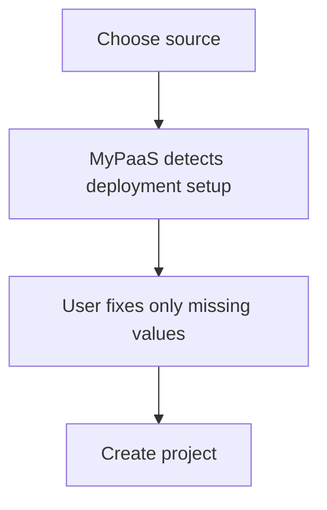

# New Project Visual Simplification Design

## Goal

Reduce cognitive load on the **New Project** page without weakening deployment validation or hiding required actions. The page should feel like a guided deployment form, not an infrastructure control panel.

The intended mental model is:



## Current pain points

The current page exposes too many surfaces with similar visual weight. `SectionPanel`, `soft-panel`, bordered status boxes, advanced `details`, repository tree, Compose Doctor, database settings, resource settings, environment warnings, and the Review sidebar all compete for attention.

This produces several UX problems:

1. **Weak hierarchy** — mandatory inputs, detected information, optional configuration, and explanatory text look equally important.
2. **Card fatigue** — nested bordered surfaces make the page feel longer and more complex than the underlying task.
3. **Repeated information** — runtime, port, resources, database, and Compose details appear both in the main form and Review.
4. **Technical explanations interrupt the task** — several helper paragraphs explain infrastructure details users usually do not need while creating a project.
5. **Repository and Compose diagnostics are overexposed** — repository structure and healthy Compose details are useful only for debugging or advanced configuration.
6. **Advanced controls are fragmented** — source, runtime, Compose, and resources each have their own disclosure region, forcing users to understand the platform's internal categories.
7. **Success state is visually noisy** — healthy detection still renders multiple panels instead of collapsing into a compact confirmation.

## Design principles

### 1. One primary surface

Use one main `surface` for project creation. Inside it, use whitespace, typography, and simple dividers to separate logical sections rather than wrapping every section in another card.

Do not introduce a new card visual language. Reuse the existing design tokens and primitives from `app.css`:

- `surface`
- `field`
- existing border tokens
- existing status/accent tokens
- `ActionButton`
- `IconButton`
- existing typography scale

### 2. Progressive disclosure

The default path should expose only controls most users need.

Visible by default:

- Project name
- Source type
- Repository URL or image reference
- Branch for Git sources
- Compact detected setup
- Required environment values
- Optional environment values
- Create action

Hidden under one consolidated **Advanced** disclosure:

- Project/base directory
- Repository structure
- Deployment mode override
- Container port override
- Compose file/path/workdir/profiles/overrides
- Main Compose service override when detection is insufficient
- Static frontend override
- Resource profile, memory, and CPU tuning
- Detailed Compose Doctor output

The Advanced area may use subsections internally, but should remain one disclosure entry in the normal flow.

### 3. Explanation on demand

Remove helper paragraphs that explain platform internals when the information is not required to complete the form.

For terms that may need context, place a small `Info` icon next to the label. Clicking it opens a short accessible popover or inline disclosure. Examples:

- Project directory
- Container port
- Shared PostgreSQL
- Resource limits
- Compose overrides

Help content should normally fit in 1–3 short sentences. Do not use tooltips for errors, required actions, or information that must be discovered to complete the form.

### 4. Detection should compress complexity

After Git repository validation, runtime analysis remains automatic.

Healthy detection is shown as one compact setup row, for example:

```text
✓ Docker Compose · api · :3000
```

The row may include a small secondary action such as **Re-analyze** and an info/details action.

States:

- loading: `Analyzing repository…`
- ready: compact detected setup
- needs configuration: short actionable message adjacent to the unresolved value
- error: inline error with retry/re-analyze action

Do not show a separate explanatory runtime card when detection succeeds.

### 5. Diagnostics are exception-driven

Repository structure is not displayed by default. It is available only under Advanced source diagnostics.

Compose Doctor behavior:

- Healthy: compact `✓ Compose ready`
- Warning/error: show the actionable issue summary in the normal flow if it blocks or materially affects creation
- Detailed service/port/env diagnostics: available under Advanced details

Warnings should point to the field or action that resolves the problem rather than rendering an independent diagnostic dashboard.

## Page structure

### Header

Keep existing breadcrumbs and `PageHeader` style, but shorten the description to task-oriented copy, for example:

> Deploy from a Git repository or container image.

Avoid explaining routing or build internals in the page header.

### Main form

The main form is a single `surface` with these sections separated by dividers.

#### A. Source

Contains:

- Project name
- Source segmented choice
- Repository URL + branch, or container image reference

Project-name route preview should be visually secondary and compact. Repository validation should happen automatically as today.

For Git, successful source validation should be represented with a subtle status line, not another bordered panel.

#### B. Detected setup

For Git, show a compact row containing only user-relevant deployment information:

- runtime type
- main service when relevant
- container port when relevant
- readiness/status

Example:

```text
Detected setup                         Re-analyze
✓ Docker Compose · api · :3000
```

For static deployments:

```text
✓ Static site · served by Caddy
```

For registry sources:

```text
Container image · port required
```

If the registry port is unresolved, expose the port input directly because it is required; do not force the user to discover a required field inside Advanced.

#### C. Environment

Environment remains a first-class section because missing values can block deployment.

Improvements:

- Show required missing env keys first.
- Keep `.env` import available as a secondary action.
- Do not wrap the database option in its own card.
- Represent shared PostgreSQL as a compact checkbox/switch row with an optional info icon.
- Keep detected environment rows editable.
- Keep localhost/service-name warnings inline with the affected environment row.

If there are no discovered variables, the empty state should be one quiet line rather than a large bordered area.

#### D. Advanced

One consolidated `<details>` or equivalent disclosure at the bottom of the main surface.

Suggested internal grouping:

- Source
- Runtime
- Compose
- Resources
- Diagnostics

These groups should use headings and whitespace, not nested cards unless a warning/error requires separation.

## Sticky summary

Keep the right-side sticky area on large screens, but drastically reduce its content.

Show only:

1. Public hostname
2. Source + branch/image
3. Detected runtime
4. Readiness state
5. Primary **Create project** action

Do not duplicate:

- CPU
- memory
- resource profile
- Compose file
- Compose profiles
- database selection
- container-port explanation
- other advanced configuration

The summary is a confirmation surface, not a second settings page.

On smaller screens, the create action should remain reachable without requiring the user to scroll back to a separate sidebar. A responsive bottom action area or end-of-form action is acceptable as long as it follows existing component patterns.

## Information popover pattern

If the repository does not already have a reusable info-popover component, introduce one small component based on the existing `IconButton` visual pattern.

Requirements:

- trigger uses Lucide `Info` or `CircleHelp`
- keyboard accessible
- uses `aria-expanded` / `aria-controls` or equivalent accessible disclosure semantics
- closes on Escape and outside interaction where practical
- help content remains concise
- does not introduce another bordered card hierarchy across the page

A native accessible disclosure is preferred over adding a heavy popover dependency.

## Visual hierarchy

Normal priority order:

1. Required user input
2. Blocking error or missing configuration
3. Detected setup/readiness
4. Primary create action
5. Optional configuration
6. Technical explanation

Use the accent color for focus, success/readiness, and primary actions. Avoid using accent backgrounds for informational content that does not require attention.

Prefer borders as section separators rather than containers around every informational block.

## Error handling

- Field validation errors remain adjacent to their field.
- Repository/runtime failures appear near Detected setup.
- Missing env values appear at the Environment section and the affected rows.
- Compose blocking issues surface a concise actionable message in the normal flow.
- Detailed technical diagnostics remain under Advanced.
- Coding-agent handoff remains exception-only and should appear only after a deployability failure where the generated prompt is useful.

## Behavioral constraints

This redesign must not change backend contracts or deployment semantics.

Preserve:

- source validation
- automatic runtime detection
- manual runtime override capability
- app-port validation
- Compose preflight behavior
- environment discovery/import
- shared PostgreSQL behavior
- resource profile values
- readiness validation before project creation
- coding-agent handoff on relevant failures

The work is primarily presentation, disclosure, and interaction hierarchy.

## Implementation boundaries

Expected primary file:

- `frontend/src/routes/projects/new/+page.svelte`

Likely reusable component addition only if needed:

- `frontend/src/lib/components/InfoDisclosure.svelte`

Existing components/design tokens should be reused before introducing anything new.

Do not broadly refactor unrelated project settings or dashboard pages in this change.

## Testing

Add or update frontend tests around behavior rather than styling details.

Minimum coverage:

- readiness behavior remains unchanged
- unresolved required registry port is visible/actionable
- automatic Git runtime detection still drives readiness
- advanced/manual overrides still affect submitted state
- blocking Compose/env errors still prevent create
- info disclosure is keyboard-accessible if introduced as a reusable component

Run existing frontend unit tests, `svelte-check`, production build, backend tests, and existing deployment-script checks before the PR is marked ready.

## Success criteria

The redesign is successful when:

- the normal path can be visually understood as Source → Detected setup → Environment → Create;
- the main page no longer looks like a stack of nested cards;
- healthy runtime and Compose detection collapse into compact status rows;
- repository structure and technical diagnostics are hidden by default;
- explanations no longer dominate the form;
- required configuration remains impossible to miss;
- the Review sidebar contains only decision-critical information;
- design remains visibly consistent with existing MyPaas surfaces, fields, buttons, colors, and spacing.
